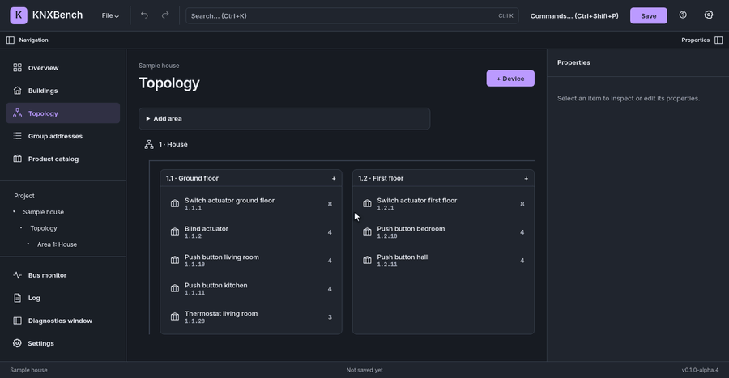
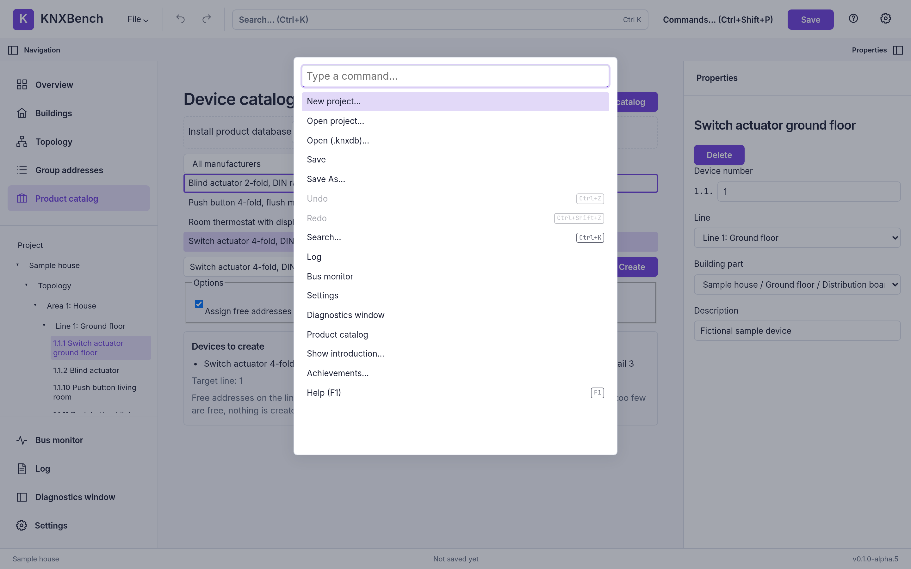

<p align="center">
  
</p>

<h1 align="center">KNXBench</h1>

<p align="center">
  <b>KNX engineering that feels at home on Linux.</b><br>
  Import your ETS projects, edit them, and watch your building's bus think — natively, in the open.
</p>

<p align="center">
  
  
  
  
</p>

> [!WARNING]
> **KNXBench is alpha software.** It works, it is tested, and it will still change under
> your feet. There is no published release yet. Keep backups of every project you would
> miss — a KNX project is the map of a building somebody paid for.

<p align="center">
  
</p>

<p align="center"><sub>Add a device, link it to a group address — the real app, the fictional sample house.</sub></p>

## What is this?

KNXBench is an independent, KNX-compatible engineering application for people who plan,
document and maintain KNX installations. Think of it as a workbench: your project goes in,
you get a clear view of every device, address and connection — and a live look at what
the bus is actually saying.

## Features

- 📥 **Imports your ETS projects. Forgets nothing.**
  `.knxproj` archives — including password-protected ETS4/ETS5 ones — come in with a report
  of every warning and everything KNXBench can't model yet. Unknown data is kept verbatim,
  never quietly thrown overboard.
- 🧠 **Watch your bus think.**
  Connect over KNXnet/IP tunnelling, discover interfaces, and follow every telegram live — as
  a table, or as a [flow view](docs/manual/user-guide/07-bus-and-interfaces.md#the-flow-view)
  where devices light up as they talk.
- ✏️ **Edit what matters. Undo what you regret.**
  Topology, buildings, devices, individual and group addresses, links, datapoint types,
  flags and device parameters — all with undo/redo.
- 📚 **A product database that eats `.knxprod` for breakfast.**
  Feed it manufacturer packages or the product data inside your projects. 852 of 853 public
  manufacturer downloads install; device objects get enriched from it.
- 💾 **Its own file format, and it actually understands it.**
  Projects live in a versioned `.knxdb` file (SQLite). Older files are upgraded safely, in place.
- 📤 **Talks back, too.**
  Send group values from the bus panel or the command line.
- 📄 **Paperwork, automated.**
  Group-address CSV export and import, a self-contained HTML project document, and a diff
  between two projects that even plays nicely with Git.
- ⌨️ **Keyboard first, mouse welcome.**
  Command palette, search, project explorer, properties inspector, drag & drop.
- 🎨 **Looks the way you like it.**
  Light, dark, and a phosphor-green CRT theme for the nostalgic. English and German interface.
- 🐧 **Linux-native, browser-ready.**
  A desktop app for Linux, or a Docker container you open in any browser — plus `knx`,
  a command line for the scriptable bits.

## See it in action

<p align="center">
  
</p>

<p align="center"><sub>The real flow view, fed with <b>synthetic traffic</b> from a fictional sample
house — no actual building was switched on and off for this clip.</sub></p>

<table>
  <tr>
    <td></td>
    <td></td>
    <td></td>
  </tr>
  <tr>
    <td align="center"><sub>Group addresses</sub></td>
    <td align="center"><sub>Device parameters</sub></td>
    <td align="center"><sub>Command palette</sub></td>
  </tr>
</table>

## Quick start

Thirty seconds to your first project, with Docker:

```bash
docker build -t knxbench-server -f apps/knx-server/Dockerfile .
docker run -d --name knxbench -p 8484:8080 \
  -e KNX_AUTH_PASSWORD='pick something long and boring' \
  -v "$(pwd)/data:/data" knxbench-server
```

Open <https://127.0.0.1:8484>, sign in with that password, and import a `.knxproj`. Your
projects live in `data/` and survive restarts. With a password the server speaks HTTPS
with a self-signed certificate, so the browser warns once: compare the fingerprint in
`docker logs knxbench` before accepting it. It is still one shared password, made for a
LAN or VPN rather than the internet. Talking to a real bus from the container needs host
networking — both are covered in
[Web and Docker deployment](docs/manual/user-guide/11-web-and-docker.md), along with
[updating in one go](docs/manual/user-guide/11-web-and-docker.md#updating-in-one-go).

**Prefer native?** [Build the desktop app from source](docs/manual/getting-started/04-installation.md#c-from-source)
— and check the [Linux setup](docs/manual/getting-started/05-linux-setup.md) for the host
packages it needs.

## Why this exists

I moved to Linux and couldn't find a KNX tool that felt at home there. So I started an AI
assistant and began building one; several hundred euros and a few million tokens later,
KNXBench had its first working alpha. In hindsight: I must have been drunk.

## Documentation

- **[The KNXBench manual](docs/manual/README.md)** — installation, a KNX primer, the user
  guide, reference and troubleshooting. No ETS experience required.
- [Implementation status](docs/manual/implementation-status.md) and
  [known issues](docs/manual/known-issues.md) — the honest picture of what works and what
  doesn't (yet).
- [Ideas and roadmap](docs/manual/ideas-and-roadmap.md) — where this is going.
- [Architecture tour](docs/manual/development/03-architecture-tour.md) — a readable map of
  the code, with the deeper engineering record in [`docs/`](docs/ARCHITECTURE.md) and the
  [architecture decision records](docs/adr/README.md).

## Contributing

Found a bug, or something the manual gets wrong? Open an issue on the
[issue tracker](https://github.com/KNXBench-Labs/KNXBench/issues). **File → Debug report**
writes a log-based report (IP addresses removed) you can attach after a quick read.
Quality gates and conventions are in [Contributing](docs/manual/development/01-contributing.md).

## License

KNXBench is free software under the
[GNU Affero General Public License v3.0 or later](LICENSE). Use it privately or
commercially, modify it, share it — and if you offer a modified version over a network,
offer its source too.
