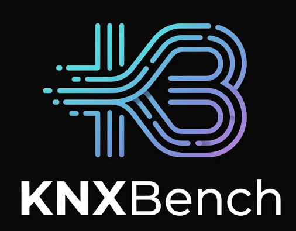
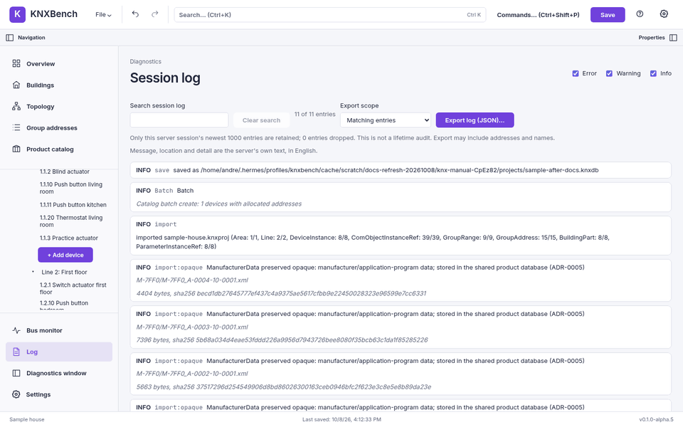
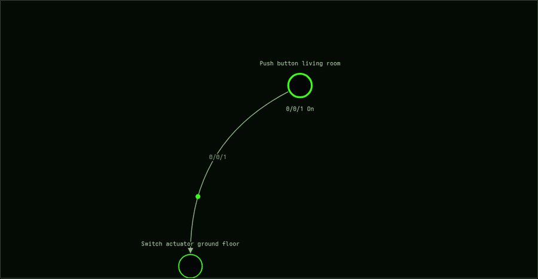
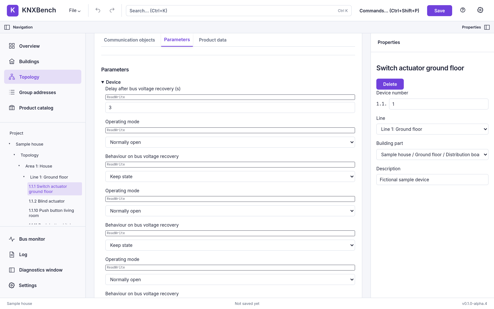
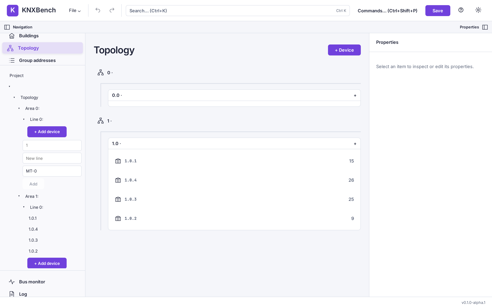
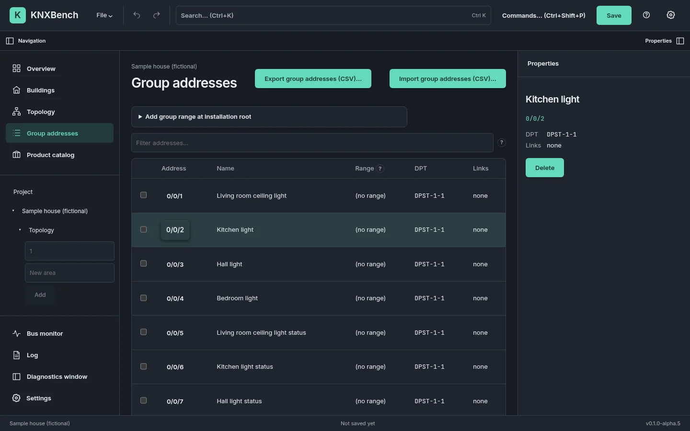
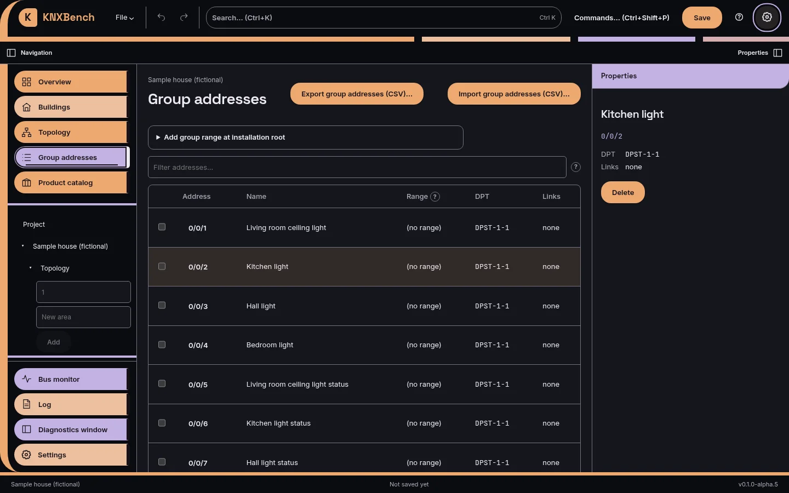
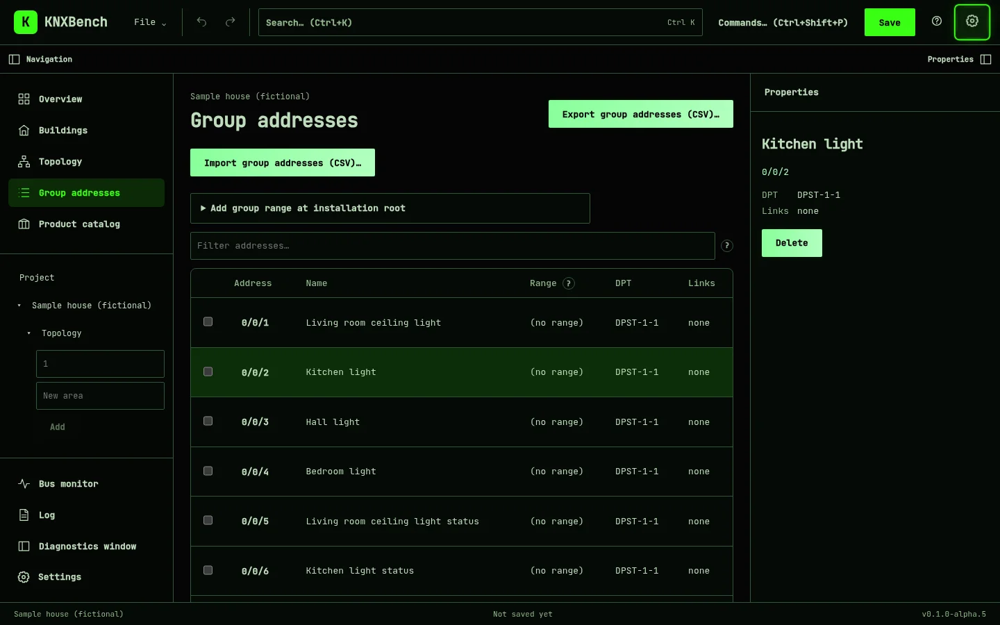

<p align="center">
  
</p>

<h1 align="center">KNXBench</h1>

<p align="center">
  <b>Open your KNX project. Finally see what's in it.</b><br>
  Import ETS projects, edit them with undo, document them and watch the bus talk —
  in your browser, or natively on Linux.
</p>

<p align="center">
  
  <a href="https://github.com/KNXBench-Labs/KNXBench/releases"></a>
  <a href="LICENSE"></a>
  
</p>

<p align="center">
  <a href="https://www.knxbench.com">Website</a> ·
  <a href="#getting-started">Get started</a> ·
  <a href="docs/manual/README.md">Manual</a> ·
  <a href="docs/ProjectStats.md">Project statistics</a> ·
  <a href="https://www.knxbench.com/story/">How this happened</a>
</p>

> [!WARNING]
> **KNXBench is alpha software.** It works, it is tested, and it will still change under
> your feet. Keep backups of every project you would miss — a KNX project is the map of a
> building somebody paid for.

<p align="center">
  
</p>

<p align="center"><sub>Pick a product, check the preview, create the device. Real app, fictional house, no hardware was bothered.</sub></p>

## What is this?

KNXBench is an independent, open-source engineering application for **KNX** building
automation — the wired standard behind a great many light switches, blinds and heating
valves. It is made for integrators, electricians and the occasional homeowner with more
switch actuators than sense.

Bring an ETS project (`.knxproj`) or start from scratch. KNXBench shows every device,
address and link in one place, lets you change them with undo, writes the paperwork for
you, and listens to the bus over KNXnet/IP. No Windows VM required just to look up a
group address.

It is not a copy of ETS and doesn't pretend to be one: it reads ETS project files,
preserves unsupported source data where technically possible, and reports the limits.
Retained bytes are not a promise of complete ETS semantics.

## Highlights

- 📥 **Imports ETS projects and admits what it doesn't understand.**
  Every `.knxproj` import comes with a report of warnings, unsupported constructs and
  conflicts. Supported opaque constructs and retained source bytes preserve otherwise
  unmodelled information; remaining preservation and mapping limits are reported.
  Password-protected ETS4/ETS5 archives are supported experimentally (so far tested on
  synthetic files only).
- ✏️ **Edit what matters. Undo what you regret.**
  Topology, buildings and rooms, devices, individual and group addresses, links,
  datapoint types, flags and parameters. Projects live in a versioned `.knxdb` file
  (SQLite) that migrates forward safely — and a file from the future is refused, not guessed.
- 🧙 **Wizards that show their homework.**
  The new-project wizard sets up areas, lines, rooms and group ranges in one step. The
  add-device wizard lets the server preview names and addresses *before* anything is created.
- 📚 **A product database that eats `.knxprod` for breakfast.**
  Install manufacturer packages, or use the product data inside your projects. In a test
  run over 853 public manufacturer downloads, 852 installed (the biggest ones need a
  command-line flag).
- 🧠 **Watch your bus think.**
  Gateway discovery, KNXnet/IP tunnelling, a live group monitor and a
  [flow view](docs/manual/user-guide/07-bus-and-interfaces.md#the-flow-view) where
  devices light up as they talk. You can send group values, too — when you mean it.
- 📄 **Paperwork, automated.**
  Group-address CSV export and import, a self-contained HTML project document with print
  preview, and a diff between two projects with an exit code your CI will love.
- ⌨️ **Keyboard first, mouse welcome.**
  Command palette, <kbd>Ctrl</kbd>+<kbd>K</kbd> search, project explorer, properties
  inspector, drag & drop.
- 🎨 **Looks the way you like it.**
  Porcelain, Graphite, Cupertino, LCARS and a phosphor-green CRT theme. English and
  German, plus Boarisch (Bavarian) and Klingon packs for the brave. And 38 optional
  achievements, because engineering work deserves a little applause.
- 🤖 **Your AI agent may look. It may not touch.**
  `knx-mcp` lets an MCP client such as Claude Code or Hermes answer questions about your
  saved projects — read-only, no bus; suggested addresses come back as a CSV you apply
  yourself ([AI agents over MCP](docs/manual/user-guide/12-ai-agents.md), experimental).
- 🐧 **Linux-native, browser-ready.**
  A Linux desktop app, or a Docker container you open in a browser — plus `knx`, a
  command line for the scriptable bits.

> [!NOTE]
> The wizards, LCARS, the achievements, the Boarisch/Klingon packs, the Devices view and
> `knx-mcp` are all in the alpha.6 release. Changes after it need Docker built from source
> or a source build.

## See it in action

<table>
  <tr>
    <td width="50%"></td>
    <td width="50%"></td>
  </tr>
  <tr>
    <td align="center"><sub>New project: structure first, devices later</sub></td>
    <td align="center"><sub><kbd>Ctrl</kbd>+<kbd>K</kbd>, type, find. That's the whole trick.</sub></td>
  </tr>
</table>

<p align="center">
  
</p>

<p align="center"><sub>The flow view, fed with <b>synthetic traffic</b> from a fictional house —
no actual building was switched on and off for this clip.</sub></p>

<table>
  <tr>
    <td></td>
    <td></td>
    <td></td>
  </tr>
  <tr>
    <td align="center"><sub>Group addresses</sub></td>
    <td align="center"><sub>Device parameters</sub></td>
    <td align="center"><sub>Topology</sub></td>
  </tr>
  <tr>
    <td></td>
    <td></td>
    <td></td>
  </tr>
  <tr>
    <td align="center"><sub>Graphite</sub></td>
    <td align="center"><sub>LCARS</sub></td>
    <td align="center"><sub>Modern Retro Green CRT</sub></td>
  </tr>
</table>

<p align="center"><sub>Every capture comes from the real application, with a fictional sample house.</sub></p>

## Getting started

### Browser, via Docker

You need Git and Docker. The first build compiles everything and takes a few minutes —
a good moment for coffee.

```bash
git clone https://github.com/KNXBench-Labs/KNXBench.git
cd KNXBench
docker build -t knxbench-server -f apps/knx-server/Dockerfile .
docker run -d --name knxbench -p 127.0.0.1:8484:8080 \
  -e KNX_AUTH_PASSWORD='pick something long and boring' \
  -v "$(pwd)/data:/data" knxbench-server
```

Open <https://127.0.0.1:8484>, sign in with that password, and choose **New project…** or
import a `.knxproj`. Your projects live in `data/` and survive restarts.

No time for coffee? Since alpha.6, every release tag is also published as a ready-made
image for x86-64 and 64-bit Arm:
`docker pull knxbench/knxbench-server:latest`, then the same `docker run` with
`knxbench/knxbench-server:latest` as the image. It is the last release, not the newest
source ([details](docs/manual/user-guide/11-web-and-docker.md#ready-made-image-from-docker-hub)).

With a password set, the server speaks HTTPS with a self-signed certificate, so the
browser warns once: compare the fingerprint in `docker logs knxbench` before you accept
it. It is one shared password, made for a LAN or VPN, not for the open internet. Talking
to a real bus from the container needs host networking — see
[Web and Docker deployment](docs/manual/user-guide/11-web-and-docker.md), which also has
the [update-in-one-go](docs/manual/user-guide/11-web-and-docker.md#updating-in-one-go) recipe.

### Linux desktop, via AppImage

```bash
REL=https://github.com/KNXBench-Labs/KNXBench/releases/download/v0.1.0-alpha.6
curl -LO "$REL/KNXBench_0.1.0-alpha.6_amd64.AppImage"
curl -LO "$REL/SHA256SUMS"
sha256sum -c --ignore-missing SHA256SUMS
chmod +x KNXBench_0.1.0-alpha.6_amd64.AppImage
./KNXBench_0.1.0-alpha.6_amd64.AppImage
```

This is the `v0.1.0-alpha.6` pre-release from 9 October 2026, x86-64 only, the first
one built by the release workflow. `--ignore-missing` skips the `knx-mcp` binary listed in
the same checksum file. It is a snapshot: newer features need Docker or a
[source build](docs/manual/getting-started/04-installation.md#c-from-source). The
[Linux setup](docs/manual/getting-started/05-linux-setup.md) chapter lists the host
packages it needs and what has been tested.

### Where it runs

| Platform | Status |
| --- | --- |
| Linux, Docker + browser | Tested; images for amd64 and arm64 on Docker Hub; the bus needs host networking |
| Linux x86-64, AppImage | Built by CI with launch checks (Xvfb, headless Weston); hand-tested on one host |
| Linux, from source | Rust 1.98 and Node.js 22.12+ ([building from source](docs/manual/development/02-building-from-source.md)) |
| Windows, macOS | No native build. Docker Desktop is plausible, but untested |

All the details: [Installation](docs/manual/getting-started/04-installation.md). Then try
[your first project](docs/manual/getting-started/06-first-start.md#tutorial-create-save-and-reopen-your-first-project)
— no KNX hardware or ETS file needed.

## Project status

**Alpha — and we mean it.** The current pre-release is
[`v0.1.0-alpha.6`](https://github.com/KNXBench-Labs/KNXBench/releases/tag/v0.1.0-alpha.6).
The test suite is large, the documentation is honest, and things still move.

- **Solid:** importing real ETS projects with a full report, editing with undo, the
  product database, documentation export, project diffs, and watching the bus
  (verified live against one gateway).
- **Early:** downloading a configuration to a real device works, but has been verified on
  exactly one device. Programming individual addresses is refused for now, on purpose.
- **Missing:** KNX Secure, AES-protected ETS6 projects, USB interfaces and multi-user
  editing. Import is one-way: KNXBench does not write `.knxproj` files.

The row-by-row picture lives in
[Implementation status](docs/manual/implementation-status.md) and
[Supported and unsupported](docs/manual/reference/02-supported-and-unsupported.md).

## Project statistics

📊 **[Project Statistics](docs/ProjectStats.md)** is the numerical engine room: commits and
code churn, AI tokens, models and tools, prompt-cache savings, and a fun-facts section
that converts it all into *Lord of the Rings* re-reads and ant colonies. It is a
generated snapshot (last run 7 October 2026), so read its numbers as "as of".

A few numbers you can check yourself, as of 8 October 2026:

- **3,721** Rust tests, **2,415** frontend unit tests and **175** browser tests passed in
  the last full gate ([implementation log](docs/IMPLEMENTATION_STATUS.md)).
- **95** [architecture decision records](docs/adr/README.md) explain why the code looks
  the way it does.

## Documentation

- 📖 **[The KNXBench manual](docs/manual/README.md)** — installation, a KNX primer, the user
  guide, reference and troubleshooting. No ETS experience required.
- 🧭 **[Documentation hub](docs/README.md)** — which shelf to read for which question.
- **Tutorials:** [your first project](docs/manual/getting-started/06-first-start.md#tutorial-create-save-and-reopen-your-first-project)
  and [a complete editing workflow](docs/manual/user-guide/06-configuration-workflow.md)
  (add a device, link a group address, save — no bus writes).
- **Guides:** [group addresses](docs/manual/user-guide/04-group-addresses.md),
  [devices and products](docs/manual/user-guide/05-devices-and-products.md),
  [bus monitor](docs/manual/user-guide/07-bus-and-interfaces.md),
  [reports and diff](docs/manual/user-guide/08-reports-and-diff.md),
  [command line](docs/manual/user-guide/10-command-line.md),
  [keyboard shortcuts](docs/manual/reference/01-keyboard-shortcuts.md),
  [FAQ](docs/manual/reference/04-faq.md) and
  [troubleshooting](docs/manual/reference/03-troubleshooting.md).
- **Under the hood:** the [architecture tour](docs/manual/development/03-architecture-tour.md),
  the [architecture](docs/ARCHITECTURE.md) document and the [decision records](docs/adr/README.md).

## Known issues & roadmap

The short version of what bites first:

- **Keep your original `.knxproj`.** Your working copy is `.knxdb`; there is no ETS export.
- **Autosave is not a backup.** There is no version history yet, so keep your own copies.
- **One server, one project, one undo stack.** Sharing a password is not collaboration.
- **Hardware support is narrow.** A project edit is not commissioning, and undo does not
  take back a telegram.

Details: [Known issues](docs/manual/known-issues.md). What is planned — and what was
decided against: [Ideas and roadmap](docs/manual/ideas-and-roadmap.md) and
[Open work](docs/OPEN_WORK.md). Bugs live in the
[issue tracker](https://github.com/KNXBench-Labs/KNXBench/issues).

## Why this exists

I moved to Linux and couldn't find a KNX tool that felt at home there. So I started an AI
assistant and began building one; several hundred euros and a few million tokens later,
KNXBench had its first working alpha. In hindsight: I must have been drunk.

The whole story, reluctantly narrated, is at
[knxbench.com/story](https://www.knxbench.com/story/).

## Contributing & support

- **Found a bug?** Open an [issue](https://github.com/KNXBench-Labs/KNXBench/issues).
  **File → Debug report…** writes a log-based report with IP addresses removed; read it
  before you attach it, because it still names your group addresses.
- **A project or product file KNXBench chokes on?** **File → Analyze support gaps…** builds
  a reduced report for the
  [contribution form](https://github.com/KNXBench-Labs/KNXBench/issues/new?template=analysis.yml).
  Read the [step-by-step guide](docs/contribution-intake/README.md)
  ([Deutsch](docs/contribution-intake/DEUTSCH.md)) first, and never attach customer files.
- **An idea?** Open an issue and describe the problem it solves.
- **Code?** Quality gates and conventions are in
  [Contributing](docs/manual/development/01-contributing.md).

There is no sponsorship page. A good bug report is the currency we accept.

## License & trademarks

KNXBench is free software under the
[GNU Affero General Public License v3.0 or later](LICENSE). Use it privately or
commercially, modify it, share it — and if you offer a modified version over a network,
offer its source too.

KNXBench is an independent project. It is not affiliated with, endorsed or certified by
KNX Association. KNX and ETS are registered trademarks of KNX Association cvba. KNXBench
does not bundle manufacturer product catalogs; you install the product files you are
allowed to use.
