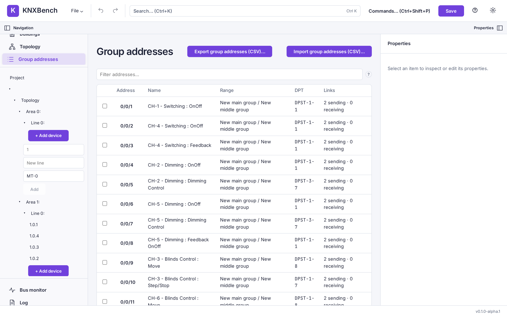

# KNXBench

**A Linux-first, KNX-compatible engineering application — an independent, open alternative
to ETS for working with KNX projects.**


> **Warning**
>
> KNXBench is **alpha software under active development**. Every program reports
> `0.1.0-alpha.1`, there is no git tag, and no release has ever been published. It is
> useful and it is tested, but it is still moving. Keep backups.



*The group address table after importing an ETS demo project: address, name, range,
datapoint type and link counts, with a filter box and CSV import/export. Porcelain theme.*

## Why this exists

I moved to Linux and went looking for a KNX application that felt native there. I did not
find one — ETS is a capable product and also a Windows program, and the usual workarounds
get old quickly. So I started an AI assistant and began building one instead. Several
hundred euros and a few million tokens later, KNXBench had its first working alpha.

In hindsight: I must have been drunk.

## What it can do today

- Import supported ETS `.knxproj` archives, with a report of warnings, errors and anything
  it could not model. Unknown data is preserved verbatim, never silently dropped. Import is
  one-way: KNXBench reads `.knxproj` and never writes one.
- Save and reopen projects in its own versioned `.knxdb` SQLite format.
- Inspect and edit topology, buildings, devices, individual and group addresses, group
  links, communication-object datapoint types and flags, and top-level device parameters.
- Undo/redo, search, a command palette, a project explorer, an inspector, themes and a
  German/English interface.
- Build up a product database from manufacturer data found in project archives or from
  standalone `.knxprod` packages, and enrich device communication objects from it.
- Export a group-address CSV, a self-contained HTML project document, and a diff between
  two projects.
- Watch a live KNX bus over KNXnet/IP tunneling, and send group values from the CLI or the
  bus panel.

Not available, and not claimed: writing a `.knxproj` (withdrawn 2026-09-20 — once imported,
a project stays in KNXBench's own format), commissioning or device download to real
hardware, KNX IP Secure, and anything resembling certification or full ETS compatibility. The wording here
is **KNX-compatible**, deliberately. See
[Implementation status](docs/manual/implementation-status.md) and
[Known issues](docs/manual/known-issues.md) for the honest current picture.

## Quick start

Build the image, run it with a password, and open it in a browser:

```bash
docker build -t knxbench-server -f apps/knx-server/Dockerfile .
docker run -d --name knxbench -p 8484:8080 \
  -e KNX_AUTH_PASSWORD='pick something long and boring' \
  -v "$(pwd)/data:/data" knxbench-server
curl -sf http://127.0.0.1:8484/healthz
```

That published-port form supports project work and manually entered gateway
addresses, but Docker's default bridge blocks the multicast used by the
**Discover gateways** button. On Linux, use host networking when discovery is
needed (host mode ignores `-p`, hence `KNX_PORT`):

```bash
docker run -d --name knxbench --network host \
  -e KNX_PORT=8484 \
  -e KNX_AUTH_PASSWORD='pick something long and boring' \
  -v "$(pwd)/data:/data" knxbench-server
```

Then open <http://127.0.0.1:8484> and sign in with that password. Your projects live in
`data/` on the host, so they survive container restarts.

The password is not decoration: `knx-server` refuses to serve an unguarded API to the
network, so without a credential it binds loopback only — which inside a container is the
*container's* loopback, unreachable through a published port. It is still one shared
password with no accounts, no roles and no TLS, so put a TLS-terminating reverse proxy in
front of anything that matters.

The full deployment picture, including the reverse-proxy option and the full environment
variable table, is in
[Web and Docker deployment](docs/manual/user-guide/11-web-and-docker.md).

## Installing it

| How | Where |
| --- | --- |
| Linux AppImage | [Installation §a](docs/manual/getting-started/04-installation.md#a-linux-appimage) — no published release yet, so this means building one |
| Docker / web | [Installation §b](docs/manual/getting-started/04-installation.md#b-docker--web) |
| From source | [Installation §c](docs/manual/getting-started/04-installation.md#c-from-source), and [Building from source](docs/manual/development/02-building-from-source.md) for the developer version |
| Host packages KNXBench needs | [Linux setup](docs/manual/getting-started/05-linux-setup.md) |
| The `knx` command line | [The command line](docs/manual/user-guide/10-command-line.md) |

## Documentation

### Shared local agent memory

Claude, Codex, and the Hermes `knxbench` profile can use the same local topic
index without merging their private stores. Preview, publish, or validate it:

```bash
python3 tools/agent_memory_sync.py preview --project-root "$(pwd)"
python3 tools/agent_memory_sync.py apply --project-root "$(pwd)"
python3 tools/agent_memory_sync.py check --project-root "$(pwd)"
```

Optional local integration installs a stable user-systemd copy and bounded
instruction blocks. Both are reversible:

```bash
python3 tools/agent_memory_sync.py install-agent-links --project-root "$(pwd)"
python3 tools/agent_memory_sync.py install-timer --project-root "$(pwd)"

python3 tools/agent_memory_sync.py uninstall-timer
python3 tools/agent_memory_sync.py uninstall-agent-links --project-root "$(pwd)"
```

Generated snapshots stay ignored under `.agent-memory/`. See
[`docs/PROJECT_CONTEXT.md`](docs/PROJECT_CONTEXT.md) for the authority order and
promotion rules.

Self-contained tasks can also run in Claude Code cloud sessions. They cannot see the
private corpus or the bus; boundaries, environment setup and task briefs are in
[`docs/CLOUD_SESSIONS.md`](docs/CLOUD_SESSIONS.md).

The manual is the place to start. It explains KNX itself where that is needed, and does not
assume you have used ETS.

- **[The KNXBench manual](docs/manual/README.md)** — installation, a KNX primer, the user
  guide, reference and troubleshooting
- [Implementation status](docs/manual/implementation-status.md) — what works, what is
  partial, what is planned
- [Known issues](docs/manual/known-issues.md) — what does not work yet, in plain words
- [Ideas and roadmap](docs/manual/ideas-and-roadmap.md) — where this is going
- [Contributing](docs/manual/development/01-contributing.md) — bug reports, quality gates,
  conventions
- [Architecture tour](docs/manual/development/03-architecture-tour.md) — a readable map of
  the code

The project's own engineering record — [Architecture](docs/ARCHITECTURE.md),
[Data model](docs/DATA_MODEL.md), [Import and export](docs/IMPORT_EXPORT.md),
[Compatibility](docs/COMPATIBILITY.md), [Known limitations](docs/KNOWN_LIMITATIONS.md),
[Roadmap](docs/ROADMAP.md) and the [architecture decision records](docs/adr/README.md) —
sits underneath the manual and is denser on purpose.

Found a bug, or something the manual gets wrong? The
[issue tracker](https://github.com/KNXBench-Labs/KNXBench/issues) is the only place
anything happens. KNXBench can prefill an issue for you: **File → Debug report**.

## License

KNXBench is free software licensed under the
[GNU Affero General Public License version 3 or later](LICENSE).

The license permits private and commercial use, modification, and redistribution under its
terms. Modified versions made available to users over a network must also offer those users
the corresponding source code as required by the AGPL.

## Before you point it at anything expensive

This is one person's alpha, developed in the open and changing weekly. Imports have been
tested against real project files, and there are still 119 documented limitations to prove
the point. Treat it the way you would treat any pre-1.0 engineering tool: read
[Known issues](docs/manual/known-issues.md) first, and keep a backup of every project you
would be unhappy to lose. A KNX project is a map of a building somebody paid for. Projects
worth keeping deserve a backup.
