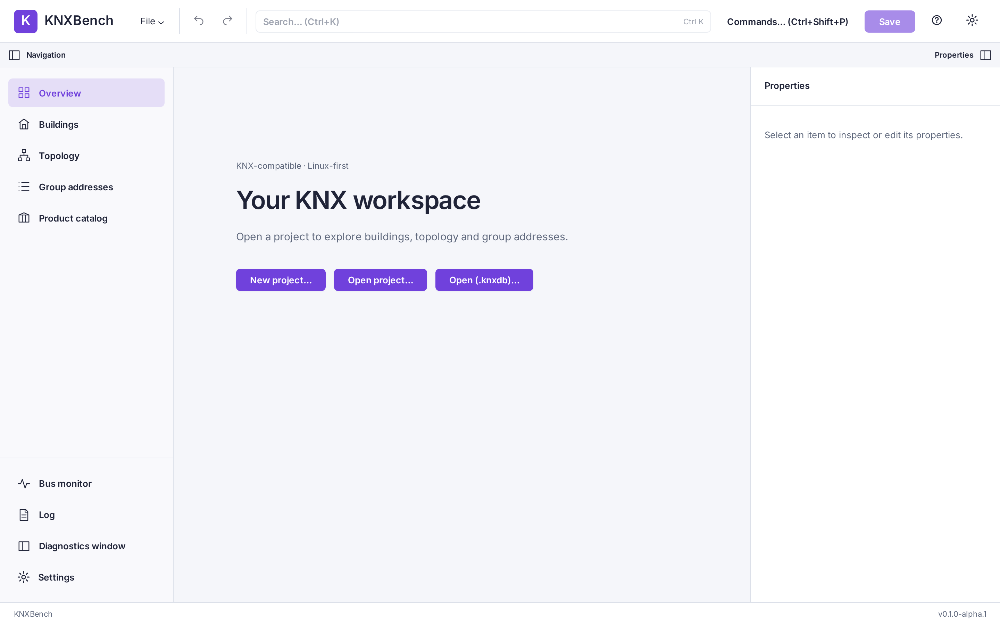
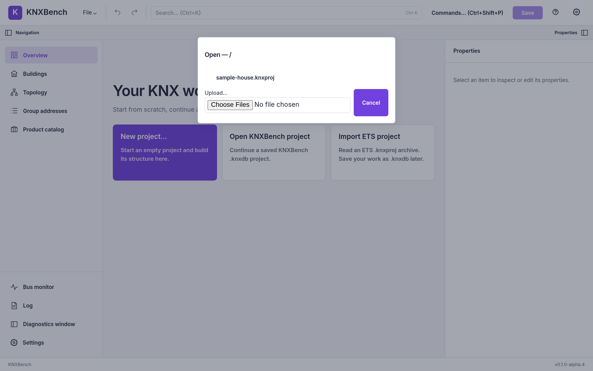
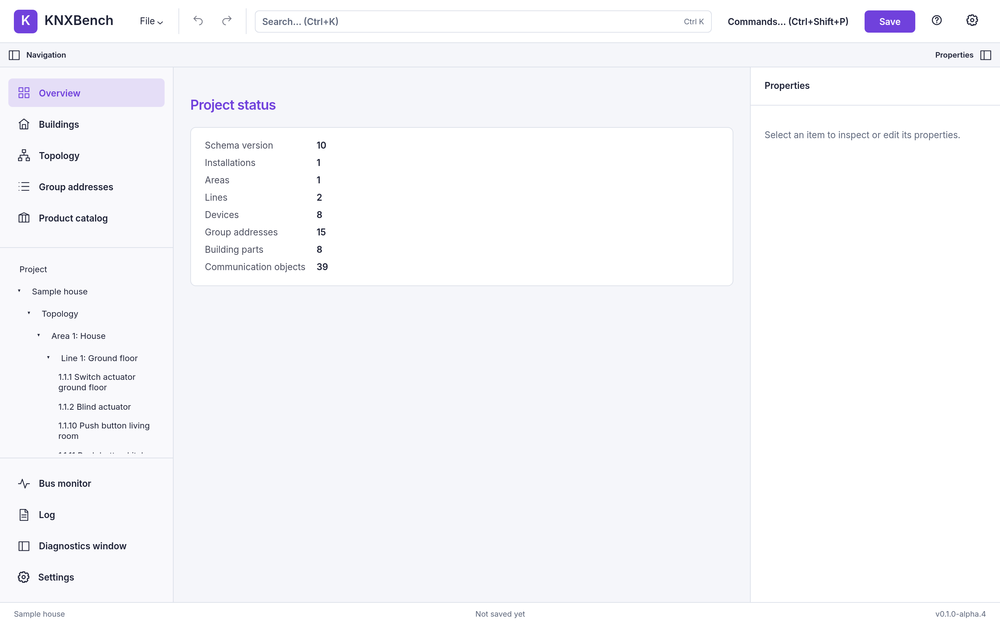

← Previous: [Linux setup](05-linux-setup.md) · [Manual index](../README.md)

# First start

This chapter walks through the first few minutes with KNXBench: what you see
before any project is open, how to open or import one, and a short tour of
the screen so the rest of the manual makes sense.

## The introduction

The very first time KNXBench starts, a short introduction opens on top of the
empty workspace. It has four pages:

1. **What this is** — an independent application, not ETS, and which release
   stage the running build is in (Alpha, at the moment) with a sentence on
   what that stage means. A switch on this page sets the interface language
   to English or German.
2. **What works, and what does not yet** — two short lists, and a link to the
   Help topic *What this does not do* for the details.
3. **Where to start** — import an ETS project, start a new project, open a
   `.knxdb`, add product data, or watch the bus. Each button closes the
   introduction and runs the same command as the command palette.
4. **Help and feedback** — where Help and the debug report are.

Nothing in it is required. **Skip introduction**, `Escape` or a click outside
closes it, and closing it in any way counts as having seen it. It does not
open by itself again until the build reaches a new release stage (a beta, for
example); to read it again, use **File → Show introduction…** or the same
entry in the command palette.

It opens by itself only over an empty workspace with no other dialog showing,
and only when KNXBench can remember that it was shown. In the web/Docker
build that memory lives in the server's settings, so it is shared: once one
person closes the introduction, it stays closed for everyone using that
server.

## The empty workspace

The first thing KNXBench shows, with nothing open yet, is a workspace with no
project loaded:

Three cards cover the three ways to start: **New project…** creates an
empty one, **Open KNXBench project** opens a project already saved in
KNXBench's own `.knxdb` format, and **Import ETS project** imports an ETS
`.knxproj` archive. The **File** menu offers the same actions as
**Open (.knxdb)…** and **Open project…**.
The left sidebar's navigation entries (Overview, Buildings, Topology, Group
addresses, Product catalog) stay visible but have nothing to show until a
project is open.

## Opening or importing a project

Choosing **Open project…** or **Open (.knxdb)…** brings up a file picker.
In the web/Docker build, the browser has no native file-system access, so
KNXBench shows its own in-browser file browser instead — the same list of
files on the server's storage that a native "Open" dialog would show, plus an
upload option for a file that only exists on your own machine:

The desktop build instead uses your Linux file manager's own native Open
dialog, since it can talk to the file system directly.

Importing a `.knxproj` works the same way from **Open project…**: pick the
archive, and KNXBench reads it.

## What the progress display means

Reading a project — whether importing a `.knxproj` or opening a `.knxdb` —
is not instant on a large project, so KNXBench shows a progress banner while
it works. The banner names the file being loaded, and steps through named
phases as they happen: opening the archive, detecting the schema version,
parsing topology, validating references, building the project model, and so
on through project-specific steps like enriching devices from the product
database. Where the server can report real "so many of so many" counts, the
bar fills accordingly; where it cannot, the bar moves without claiming a
specific percentage — an honest "still working," not an invented one.

> **Note**
>
> The banner also rotates a one-line joke while it waits, and drops the humor
> immediately if the load fails. A progress bar is allowed to be entertaining;
> an error message is not.

If a load fails, the same banner reports what it was doing at the time
instead of disappearing quietly.

## A quick tour of the screen

Once a project is open, the same three-pane layout is used throughout
KNXBench: navigation on the left, the main workspace in the center, and a
properties inspector on the right. The Overview screen is a good first stop
— it summarizes what was loaded:

The counts here — areas, lines, devices, group addresses, communication
objects — are the same structures the rest of this manual explains one at a
time: topology and individual addresses, group addresses, and devices with
their communication objects and parameters.

This manual does not re-explain the whole interface in this chapter.
[The user interface](../user-guide/01-user-interface.md) covers the
navigation sidebar, the workspace views, the properties inspector, and the
overlays (search, command palette, settings, and the rest) in full.

[Manual index](../README.md) · Next: [KNX in a few minutes](../knx-basics/01-knx-in-a-few-minutes.md) →
