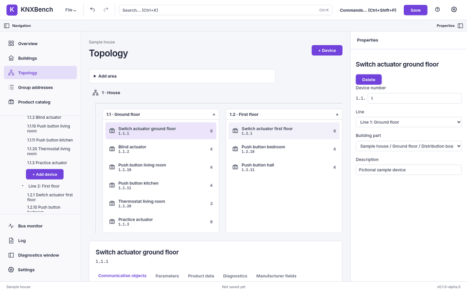

← Previous: [Products and product databases](../knx-basics/05-products-and-product-databases.md) · [Manual index](../README.md)

# The user interface

**Goal:** find the explorer, workspace, inspector, search and command palette.
**Prerequisites:** a running app; open a disposable project to explore populated views.
**Expected result:** you can select an item and find its properties without changing
the project. **Watch out:** selecting is not editing, and closing a tab is not saving.

KNXBench opens as one window with one job: show you a KNX project and let you change
it. There is no ribbon, no floating tool window, and nothing that has to be docked
before it works. This chapter walks around the window once, names every part, and
says what each part is for.

That is the whole window before any project exists. Notice that the navigation pane,
the workspace and the properties pane are already there and already empty — the layout
does not change shape when a project arrives, it only fills up.

On the very first start, and again when the build reaches a new release stage, a
four-page introduction opens over this window first; [First
start](../getting-started/06-first-start.md#the-introduction) describes it.

## The header

The top row, left to right:

- **KNXBench** — the brand, and also a button: it takes you back to the Overview.
- **File** — a drop-down menu with project and export actions. It is
  covered in [Projects](02-projects.md).
- **Undo** and **Redo** — two arrow buttons. They are gray when there is nothing to
  undo or redo. Every edit in KNXBench goes through the same command stack, so undo
  works the same way for a renamed room as for a bulk delete.
- **Search… (Ctrl+K)** — opens the project search. Disabled until a project is open.
- **Commands… (Ctrl+Shift+P)** — opens the command palette.
- **Save** — the one purple button. If the project has never been written to a file,
  Save behaves as Save As and asks you where to put it.
- **?** — opens the help panel. `F1` does the same from anywhere in the main window.
- **The gear** — opens Settings. See
  [Settings, themes and languages](09-settings-and-appearance.md).

The web File menu includes **Export project…** for a local `.knxdb` copy of
the open project. The desktop build instead has native file dialogs and adds
**Quit**; a browser tab cannot close itself. Neither build exports `.knxproj`.

## The strip below the header

A thin bar carries the two pane toggles: **Navigation** on the left, **Properties** on
the right. Each one hides or shows its pane, which is useful on a small screen and
essential on a laptop in a basement.

Two things appear in this bar only when they have something to say:

- **Bulk actions**, when you have more than one device or group address selected. See
  [Buildings and topology](03-buildings-and-topology.md).
- **Import: N errors · M warnings**, when the project was imported and the import
  found something worth telling you about. Clicking it goes to the Overview, where the
  counts are broken down. [Projects](02-projects.md) explains what those numbers mean.

## The navigation pane

The left pane has three stacked blocks.

**The views**, at the top:

| Button | What it shows |
| --- | --- |
| Overview | Project status: counts of everything, plus import errors and warnings |
| Buildings | The building structure as cards, with the devices placed in each part |
| Topology | Areas, lines and the devices in them |
| Devices | The project-wide, filterable/sortable device table; a device click opens its central editor |
| Group addresses | The group-address table |
| Product catalog | Opens the catalog overlay, not a view — see [Devices and products](05-devices-and-products.md) |

**The project explorer**, in the middle: the project as a tree — Topology, Buildings,
Group Addresses, Group Ranges, and any unassigned devices. This is where you create
things. Each branch that can hold a new child has an inline row at the bottom of it:
type a name, press Enter or click Add, and the object exists. No dialog opens.

**The diagnostics block**, at the bottom: **Bus monitor**, **Log**, **Diagnostics
window** and **Settings**. The first two swap the center workspace for a panel; the
third opens a second window (below); the fourth opens the Settings overlay.

The Overview of the fictional sample project the manual's screenshots use: 1 area,
2 lines, 8 devices, 15 group addresses, 8 building parts, 39 communication objects.
The tree on the left shows the same project, opened at its first line.

## The workspace

The center is whatever the selected view shows. Selecting a device from the tree,
topology/building diagram, search or a device link switches the center to its
editor, rather than appending it below the previous view. **Devices** stays marked
in the navigation. **Back** returns to the originating app view; **All devices**
opens the project-wide device table. Filter, sort, table scroll and checkbox
selection survive the editor visit. The existing Properties inspector remains
on the right. See [Devices and products](05-devices-and-products.md#the-devices-view).

The Devices package is a newer, locally implemented source feature, not a
replacement of the released alpha.5 AppImage. Publication/deployment state is
tracked in [Open work](../../OPEN_WORK.md).

The Bus monitor and the Log replace the workspace entirely while they are open, and
the properties pane hides itself while they are, because neither of them has a
selection to inspect.

In **Log**, type into **Search session log** to match operation, summary or
detail without changing the severity checkboxes; **Clear search** restores
the unsearched view. The result count compares shown entries with the
retained total. **Export scope** chooses either those matching entries or
all retained entries, then **Export log (JSON)…** saves `session-log.json` to
your computer. JSON v1 preserves raw timestamp, severity, source/operation,
message/summary, location, detail and diagnostic metadata, including
quotes, line breaks and Unicode; it is not spreadsheet CSV. The export
contains the cap and loss notice even when filtering hides the notice.
Only this server run's most recent 1000 entries exist here; older entries
may have been dropped, and opening a replacement project or restarting the
server resets the trail. **This is not a complete audit.** Entries may name
project elements, KNX addresses or local paths; check before sharing the
file. The desktop build opens an OS save dialog; browser export uses a local
file download, not the server's Save As directory.

## The properties pane

The right pane inspects whatever is selected and lets you edit it. It says "Select an
item to inspect or edit its properties." when nothing is. What it offers depends on
what is selected: a device has an address, a line, a building part and a description;
a building part and a group range can be renamed; an area or a line can only be
deleted. The chapters that follow say which is which.

## The footer

One line at the bottom: the installation names of the open project (or just
"KNXBench" when nothing is open) on the left, and the version on the right. The
screenshots in this manual were taken from `v0.1.0-alpha.4` and the development
build after it, which still reports that version.

## Resizing

Both side panes have a drag handle on their inner edge. Drag it, and the pane resizes
within its limits — the navigation pane between 200 and 480 pixels, the properties
pane between 280 and 700.

The handles are also keyboard controls. Tab to one, then:

| Key | Effect |
| --- | --- |
| Left arrow / Right arrow | Move the edge by 16 pixels |
| Home | Jump to the minimum width |
| End | Jump to the maximum width |

With a project open, two horizontal splitters appear inside the navigation pane: one
above the project explorer, one below it. They give height back and forth between the
view buttons, the tree and the diagnostics block. They take arrow keys too — up and
down instead of left and right, in the same 16-pixel steps, with Home and End for the
limits.

> **Tip**
>
> Pane widths are not saved yet. Every start begins at the default layout. If that
> annoys you, it annoys us as well; see [Known issues](../known-issues.md).

## The overlays

Seven things open on top of the window instead of inside it. All of them close with
`Escape` or with their own Close button.

**Search** (`Ctrl+K`) searches the open project — devices, group addresses and
building parts, grouped by kind. It matches as you type, arrow keys move through the
hits, Enter selects one and takes you to it, reopening the containing Project
Explorer branches when necessary.

Searching the sample project for "light": eight group addresses match, each shown with
its name and its address.

**The command palette** (`Ctrl+Shift+P`) lists every command KNXBench has as a
keyboard-reachable list. There are sixteen: New project, Open project, Open
(.knxdb), Save, Save As, Undo, Redo, Search, Log, Bus monitor, Settings, Diagnostics
window, Product catalog, Show introduction, Achievements, Help. Typing filters the
list by substring.

Undo and Redo are gray here because this project has no history yet. The palette shows
each command's shortcut where it has one, which makes it a decent way to learn them.

**Help** (`F1`, or the `?` button) has eleven short topics about this window
and the KNX terms behind it: Getting started, The window, Buildings floors
and rooms, Areas lines and devices, Group addresses, Group address ranges,
Communication object flags, Bus monitor, Import, Keyboard, and What this
does not do. A tip's `?` button opens its own full topic on click or Enter;
F1 while that tip is focused opens the same topic. Elsewhere F1 starts at
**The window** overview. The topic heading names the dialog for a screen
reader and its prose can be reached by keyboard. In the Group addresses
table, the **Range** tip explains nested address containment: ranges are
not datapoint types or payload-value intervals. A validation toast for a
malformed address, DPT or project language also shows the expected syntax
and one example; the original server detail remains available for diagnostics.

The import topic is named **Import**, not "Import and export", because KNXBench does
not export `.knxproj` ([ADR-0028](../../adr/0028-no-knxproj-export.md)).

The help panel is deliberately short. It answers "what is this thing on my screen",
not "how does KNX work" — that part is this manual's job, starting at
[KNX in a few minutes](../knx-basics/01-knx-in-a-few-minutes.md).

**Settings** (the gear) holds theme, accent color, density, motion style, motion level,
interface language and product-data language. See
[Settings, themes and languages](09-settings-and-appearance.md).

**The product catalog** and **New project** are the two overlays that create something.
They are covered in [Devices and products](05-devices-and-products.md) and
[Projects](02-projects.md).

**About KNXBench** shows version and license information.

**The introduction** (**File → Show introduction…**, or the palette) is the
four-page guide described in [First
start](../getting-started/06-first-start.md#the-introduction).

**Achievements** (**File → Achievements…**, or the palette) lists the
achievements you have unlocked and the ones still ahead. See
[Settings and appearance](09-settings-and-appearance.md#achievements).

## The second window

The **Diagnostics window** button opens a separate browser window (or a second desktop
window) carrying two tabs and nothing else: **Bus monitor** and **Log**. It is
read-only by design. It has no undo, no project editing, no help panel of its own, and
a "Back to main window" button to get you home.

It shares the one bus session with the main window rather than opening a second one,
and it announces as much at the top of the window. Both windows watching one session
is the point: you can keep the monitor on a second screen while you work in the first.

> **Note**
>
> The diagnostics window does not clean up the bus session when you close it. If a
> session is running, stop it from the bus monitor rather than by closing the window.
> [Bus monitor and KNXnet/IP](07-bus-and-interfaces.md) covers sessions properly.

## Keyboard

*Search filters project results; it does not scan the KNX bus.*

The shortcuts that work anywhere in the main window:

| Shortcut | Action |
| --- | --- |
| `Ctrl+K` | Search (needs an open project) |
| `Ctrl+Shift+P` | Command palette |
| `F1` | Help |
| `Ctrl+Z` | Undo |
| `Ctrl+Shift+Z` | Redo |
| `Escape` | Close the overlay on top |

Undo and redo deliberately do nothing while the focus is in a text field, a select, or
a dialog — inside a text box, `Ctrl+Z` belongs to the text box.

A fuller list lives in [Keyboard shortcuts](../reference/01-keyboard-shortcuts.md).

[Manual index](../README.md) · Next: [Projects: create, open, import, save, export](02-projects.md) →
