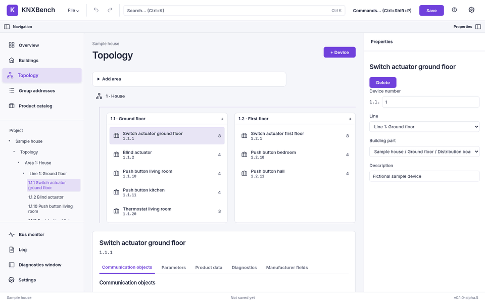
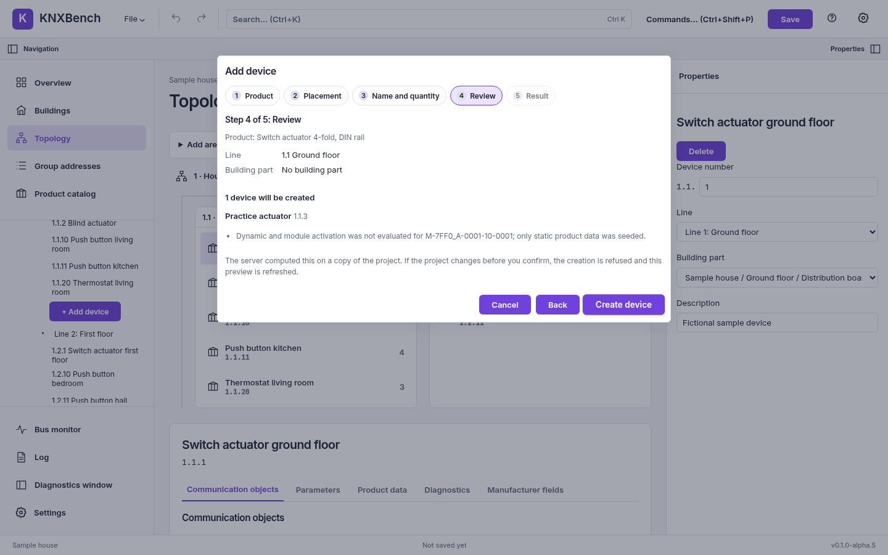

← Previous: [Working with group addresses](04-group-addresses.md) · [Manual index](../README.md)

# Devices and products

**Goal:** install product data, add a device and edit its project configuration.
**Prerequisites:** an open project and an authorised product package, or product data
from an imported project. The fictional sample is enough for practice.
**Expected result:** a device in the explorer, with its application objects and parameters.
**Watch out:** installation diagnostics matter; an offline editor does not establish
download compatibility. Legacy VD support is partial and offline-only.

A KNX device is not much use to an engineering tool on its own. What makes it
configurable is its **application program**: the manufacturer's description of what the
device can do, which **communication objects** it exposes, and which parameters change
its behavior. That description comes from a **product database** — a file the
manufacturer publishes, not something KNXBench invents. See
[Products and product databases](../knx-basics/05-products-and-product-databases.md).

This chapter covers the catalog, adding a device, and the device panel's objects,
parameters, product data, diagnostics and inspection-only manufacturer fields.

## The Devices view

Open **Devices** in the left navigation, run **Devices** from the command
palette (Ctrl+Shift+P), or click the device count in Overview. The flat table
shows every canonical device once, including unassigned/unplaced devices.
It separates installation/KNX-line placement from complete building/room paths;
a device listed in both branches is not counted twice.

Filter by name, individual address, description, manufacturer, product, order
number or placement. Click a column heading to sort it; click again to reverse
it. Individual addresses sort numerically. The wide table scrolls locally on
small screens rather than widening the whole page.

Click a row/name/address to open the existing device editor **as the central
view**, with Properties still on the right. **Back** returns to the view you
came from; **All devices** opens the table. Filter, sort, scroll and checkbox
selection are kept during an editor visit, but are not stored in the project.
Checkboxes and Ctrl/Meta/Shift clicks use the existing bulk actions. Shift-click
uses only the filtered/sorted table order. Removed targets are pruned when the
project snapshot changes.

Manufacturer/product/order data is resolved by one read-only batch, not by
opening every device's parameter editor. Missing references, a missing product
database, an uninstalled product and a failed lookup are named distinctly.
**Refresh product data** repeats the read. Untranslated product text carries the
existing language-fallback badge. A failed product query still returns canonical
device identities; an unreachable/malformed batch leaves the current tree rows
visible with an error. Unplaced devices require a successful identity-batch read.
Resolution is not application or download compatibility.

Device links also appear at group-address participants and in their inspector,
monitor source addresses, line-scan results, readiness rows and explicit **Open in
device editor** actions in the download/address/inspection panels. Address-only
links need exactly one current-project match; missing or ambiguous matches remain
plain text with a hint. They do not start a scan, tunnel, download or bus write.
The monitor keeps collecting/polling while its editor visit hides it.

This package does not add URL deep links, browser Back/Forward, switchable table
grouping, free-text log parsing or project-diff links. The separate diagnostic
companion does not become another editing window. See the
[contract and evidence](../../DEVICE_NAVIGATION.md).

The Devices view ships with `v0.1.0-alpha.6` (AppImage and Docker Hub image);
the older alpha.5 AppImage does not include it.

## The product catalog

Open it from the navigation pane (**Product catalog**) or from the `+` button on a
line in the Topology view. Both open the same centre workspace; only the target line
differs. The `+ Add device` rows in the project explorer open the
[add-device wizard](#the-add-device-wizard) instead.


A row shows `name (number) — description`, as in the screenshot, and the same
product can appear more
than once — one row per catalog item in the database, including
several entries that differ only in a number. KNXBench shows what the database
contains; it does not deduplicate on your behalf.

The manufacturer select and the search field combine: the search runs on the server
over the filtered set, a moment after you stop typing. Arrow keys move through the
results and Enter picks the highlighted one, which fills the name field below — picking
is not creating.

### Installing a product database

The file picker at the top of the workspace takes a `.knxprod` file, the package format
manufacturers publish. Installing reports what happened in one line: whether the
package was new or already installed, which scheme it used, and how many members,
unknown entries and conflicts it contained. The catalog list refreshes immediately
afterwards.

### Old ETS3 product databases (`.vd3`, `.vd4`, `.vd5`)

The same file picker also takes an old ETS3-era product database. Most of these
files are encrypted: KNXBench then asks for the password. KNXBench ships no password
and never guesses one. Tick **Remember this password** and the server keeps that one
password, in a file only its own user can read (`~/.config/knx/legacy-vd-password`,
mode 0600), so later imports need none. A second remembered password replaces the
first. **Settings → Legacy product database password** shows whether one is
remembered and forgets it.

The report lists the application programs, the catalog entries, parameters,
communication objects and translations, and every import note. Devices from such a
file can be placed, parameterised and linked to group addresses. They cannot be
downloaded yet, and their objects carry no data point type until you set one. See
[ADR-0094](../../adr/0094-legacy-exim-product-files.md).

> **Note**
>
> Two limits are worth knowing before you go looking for a file. Legacy `.vd2` product
> data is refused with an explicit message rather than half-read, and a `.knxprod`
> whose contents are encrypted cannot be installed either. See
> [Known issues](../known-issues.md).

Normal project import also ingests the product data carried inside a `.knxproj`.
To ingest that data separately from a project editing session, use the CLI:

```bash
knx products ingest project.knxproj --product-db products.db
```

See [The command line](10-command-line.md).

## The add-device wizard



*A project edit only. The clip uses the fictional Sample house and does not talk to hardware.*

The wizard is a guided path to the same result as the catalog, in five steps:
**Product**, **Placement**, **Name and quantity**, **Review** and **Result**.
Open it from:

- a `+ Add device` row in the project explorer: under a line (that line is
  chosen), under **Unassigned** of any installation (that installation, no line),
  or under a room (that room is chosen);
- **Add device…** in the command palette (Ctrl+Shift+P), aimed at the selected line
  or building part if there is one;
- **Add devices now** at the end of the new-project wizard (the new line 1.1);
- **Add with wizard…** in the catalog, which starts at **Placement** with the product
  selected there.

| Step | What you decide |
| --- | --- |
| Product | Search the installed catalog, or install a `.knxprod` package first. An installed package stays installed even if you cancel. |
| Placement | Line and building part, each optional; the installation only when the project has more than one. Line and building part must belong to the same installation. |
| Name and quantity | Name, 1 to 32 devices, **Assign free addresses on the line** (only with a line) and **Keep names unique**. |
| Review | The server computes, on a copy of the project, exactly which names and addresses would be created, with the product diagnostics. Nothing changes yet. |
| Result | What was created. **Open device** selects the first one; **Add more of this product** goes back to the naming step. |

**Create** sends the previewed names and addresses along. If the server would now
compute different names or addresses, for example because another window took an
address, it refuses with nothing created. This does not lock the whole project:
other edits may leave that expectation unchanged, and deleted placements can
cause an ordinary validation refusal. The wizard shows a fresh preview after a stale-name/address refusal to
confirm. Creation and placement are **one undo step**. Parameters and group links are
not part of the wizard; edit them in the device panel afterwards.



Check the computed address, not just the green-looking button. A preview describes
the current project; it does not reserve a bus address or confirm hardware compatibility.

**Cancel** or **Escape** asks before discarding a choice; a second **Escape** keeps
you in the wizard. A lost response is treated like in the catalog: **Retry safely**
resends the same request id while the same server is running and never creates a
duplicate.

The new-project wizard's optional seed is the project's initial structure,
not a separate undo step. Device creation afterwards is undoable; neither
wizard programs physical devices.

## Adding a device

1. Select the line the device belongs to, so the catalog knows where to put it.
2. Open the catalog.
3. Filter by manufacturer, search, and click the product.
4. Correct the name if you want — it is pre-filled from the catalog entry.
5. Set **Quantity** from 1 to 32 and check the preview. One device keeps the
   entered name; multiple devices are named `<name> 1`, `<name> 2`, etc.
6. Click **Create** (or press Enter in the name field).

The device appears in the line, with one communication object per communication-object
reference its application program declares.

The catalog occupies the centre workspace, not a modal dialog. Switching to a
normal project view and back preserves your filter, search and selection; closing
the catalog resets them. On narrow screens the navigation pane collapses after
you open the catalog so the work area is visible immediately; use **Navigation**
in the toolbar to reopen it. If no line is selected, devices stay unassigned.
For multiple devices the server performs **one atomic action**: a refusal adds
none, and one **Undo** removes the entire batch. Created devices and their
individual diagnostics remain visible for review until you close the catalog.
An older server that ignores the quantity may create only one device: the UI
refreshes the returned project, warns you and **does not automatically retry**.
If a batch request loses its response or the server reports an internal error,
its outcome cannot be confirmed from that response. The catalog asks you to
inspect or reload the project before another attempt rather than offering an
immediate duplicate-producing retry.

Two things to decide before creating:

- **Address allocation is optional.** With a target line, **Assign free addresses
  on the line** previews and assigns available project addresses. Without that
  choice the device remains unaddressed. This does not program physical hardware.
  You can also assign an address separately in Properties. See
  [Buildings and topology](03-buildings-and-topology.md).
- **No name change afterwards.** Devices cannot be renamed in KNXBench yet, so the
  name you type in this workspace is the one you keep.

### Creation diagnostics

If anything about the product was less than perfectly clear, the catalog stays open and
lists it under **Creation diagnostics**. The device is created either way — the
diagnostics describe it, they do not block it. You will see at least one of them every
time, and it is the honest one:

```text
Dynamic and module activation was not evaluated for <program>; only static
product data was seeded.
```

In plain words: the device got every communication object its program declares, rather
than only the ones its parameter settings would actually switch on. A real device's
object list depends on its parameters, and that evaluation is not run at creation time.
Expect a fresh device to list more communication objects than the physical product
would show in ETS.

For a batch, each device's warning is labelled with its name/index. Other
diagnostics you may meet: a product with no application program (created without
communication objects), a datapoint type the database states as several alternatives
(filled with none, alternatives listed), and a reference the installed program does not
contain.

## The device panel

Select a device and the center of the workbench shows its panel: the name, the
individual address and tabs for objects, parameters, product data, diagnostics
and manufacturer fields. `←` and `→` move between tabs, `Home` and `End`
jump to the first and last.

### Address and line

For a device already in a topology line, the **area.line** prefix is fixed by
that line; edit only the **device number** (1–255) and press Enter or leave the
field to apply the reconstructed address. A device not assigned to a line
instead offers the complete individual address. A duplicate address, a number
outside the range, or a line/prefix mismatch is rejected with a reason. An
imported mismatch is shown so you can repair it rather than being rewritten
without permission. If the imported topology lists one device in several
positions (including a repeated reference on one line, both a line and
the unassigned list, or two unassigned entries), or one line in multiple areas, this address control is disabled;
it does not guess which prefix wins. Repair the topology outside this editor
before moving such a device. Newly assigning device number `0` is not
supported until couplers can be identified reliably; existing imported `.0`
values are kept.

Line moves and address edits are separate actions: changing the line does
**not** renumber the device. To move an addressed device to a different line,
first clear its address, choose the target line, then assign a number under
that line's new prefix. An imported prefix mismatch can likewise be cleared
before moving. A refused move leaves the project unchanged. The line picker
currently supports devices in the first installation only. These controls
edit the project; they do not connect to, program or download a KNX device.

### Communication objects


One collapsible **channel group** per evaluated channel, initially closed. The
application program's evaluated ownership determines grouping; neither the
object's name nor a printed channel number is used to guess it.
An evaluated channel shows its translated product **Text** when present and
its source **Name** as a separate fact. If Text is absent, the source Name
becomes the heading; if both are absent, the group says **Untitled channel**.
The source **Number** appears beside either heading as text (it need not be a
decimal number). Name and Number are shown as supplied, not translated,
reformatted, used as keys, or joined into an invented label.
A channel-independent block gets its own group. Objects without evaluated
channel ownership — including inactive, uncertain and not-evaluated objects —
remain visible under **Without evaluated channel**, not silently discarded.
Opening a group and then an object row is possible by mouse or with Enter on
the focused headings. Expanded groups stay open when the same device's detail
refreshes and reset when you select another device.

Each object row shows its number, name, product function text when available,
its canonical datapoint type and any translated DPT description, its activation
state, and linked group addresses. **Active**, **Inactive**, **Undetermined**
(cannot decide from the available product/parameter evidence), and **Not
evaluated** (no usable program evaluation) mean different things. The project's
stored `IsActive` claim remains separate; if it disagrees with an evaluated
active/inactive state, the row says **Stored active** or **Stored inactive**.
No status silently rewrites the imported project. An object whose project DPT
is empty can show a **Program default** DPT for reference; opening the row
still leaves the editable DPT field empty until you explicitly set one.
An unknown or ambiguous DPT remains absent instead of being guessed.

The screenshot above predates the channel-group wrapper; the editing controls
inside each object remain the same. Expanding a row gives you:

| Control | What it does |
| --- | --- |
| DPT | Sets the object's datapoint type |
| Description | Sets the object's description |
| Flags | Read, Write, Transmit, Update, Communication, Read on init (with standard letters) |
| Group links | One row per directional link, with Unlink; paired links can be unlinked together |
| New link | Pick an address, choose Send, Receive or Send + Receive, then click Link — or drop a group address from the Project Explorer on this row, which links it in the direction the row shows |

The six toggles retain their KNX letters — `R`, `W`, `T`, `U`, `C` and `I` —
and now show their full names alongside them. KNXBench stores what you set; it
does not second-guess whether a combination is sensible for the product.
Send + Receive creates **two separate links as one undoable edit**. If either
already exists, neither is added; you may unlink or edit the individual
Send/Receive links afterward. “Unlink both” likewise removes the pair in one
undo step; a refused paired unlink leaves the other links in their original
order, and Undo restores a removed link to its previous position. The
screenshot above predates the expanded flag labels and the paired-link
control; the current controls include both.

Five of them are written back on export. **Read on init (`I`) is not.** No ETS project
file this project has measured states that flag per communication object, so the
exporter leaves it out rather than invent a place for it — and tells you, with an export
warning counting the objects that had it switched on. The value stays in your `.knxdb`;
it just does not survive a trip through `.knxproj`.

This is the only place in the interface where a link between a communication object and
a group address is created. [Working with group addresses](04-group-addresses.md)
describes the view from the other end.

#### Where a value came from

Next to the datapoint type and the description you may see a small badge — `Program`,
`ProgramRef`, `Instance`, `Inferred` or `UserEdit`. It says which layer the shown value
came from: the application program's default, the program's per-variant override, the
value stored in the imported project, something KNXBench derived, or your own edit.

That badge distinguishes imported values, product defaults, derived values and
your edits. It is not a promise of ETS export: there is no `.knxproj` writer.
Save the native project and retain the product database; product defaults and
an explicit user override are different evidence, even when their values match.

The same rule drives **product-data enrichment**, which runs at the end of an import
and once per device created from the catalog: for every communication object, slots the
project left empty are filled from the installed application program. Only genuinely
empty slots. A value the project file stated — even an empty or a malformed one — is
left exactly as it was, rather than replacing preserved source evidence with a guess.
Nothing is guessed: a datapoint type stated as a list of alternatives fills nothing and
is reported instead.

If no product database is installed, the import simply says so and skips this step.

### Parameters


The tab loads the device's parameters when you select the device. What you get:

- **Sections.** One for the device itself, plus one per module instantiation —
  a device with twelve channels shows twelve sections, never one merged list.
- **Fields.** A select for a choice parameter, a number field with the program's own
  minimum and maximum for a numeric one, a text field otherwise. Values commit on blur,
  and Enter is a shortcut for that. A rejected value snaps back with the reason.
- **Headings and spacers.** A parameter without a value (ETS `TypeNone`, or type 0
  in an old `.vd*` database) is drawn as a bold heading with its text, or as blank
  space when it has none. It never gets an input and cannot be written.
Evaluation notices are no longer printed above the editor or repeated inside
sections. Manufacturer-declared Access Read/None fields are in their own tab.
Actual rejected edits still show their reason next to the edited field.

### Diagnostics

Next to **Product data**, **Diagnostics** counts informational notes separately
from warnings. Repeated messages with the same cause, severity and exact
section scope become one entry with an occurrence count, such as **6 occurrences**.
The explanation for an unmatched selection says the controlling value matched
no option; it does not claim a broken manufacturer program. Unknown severity
is still treated as a warning, and unknown diagnostic kinds keep their message.

Open **Technical details** to inspect every original record, or **Copy details**
to copy all records in that group. Product-language fallback summaries and
**Stale values** (stored values with no matching parameter in the current
program) also live here. Those values are preserved, never silently dropped.

### Manufacturer fields

**Manufacturer fields** lists evaluated fields that the manufacturer explicitly
marked **Access Read** (read-only) or **Access None** (hidden from normal user
access). Both remain inspection-only, with the access-specific reason next to
the field. This replaces the old “Show fields without user access” fold in
Parameters. Other refusal reasons do not automatically make a field a
manufacturer-access restriction; those fields stay in Parameters with a
read-only caption pointing to Diagnostics.

Only already evaluated fields are shown, not every static field in the product
database. Switching these tabs does not reload the device or write a parameter.

Some fields are read-only, with a caption saying so. That is the honest answer to a
hard case: a module-scoped parameter can only be written when exactly one module
instance in the project is unambiguously its target. When two instances share one
reference, when a module carries no identifier, or when the project was imported by an
older KNXBench version that did not yet store module instance identifiers, the field
stays read-only and the diagnostics say which of those it is.

**What editing a parameter does.** It stores the value in the project, as a single undo
step, after validating it against the program's declared parameter chain. The server
then re-evaluates the program's dynamic tree with the new value, so fields and
communication objects that the new setting switches on or off change in the same
response.

**What it does not do.** Editing a parameter does not itself talk to a
physical device. It changes the project value and re-evaluates the displayed
program state; writing configuration to hardware is a separate, explicitly
gated device-download operation, never a side effect of this field.

> **Note**
>
> Parameter interpretation is the least finished part of KNXBench, and the project
> documents it in detail rather than glossing over it: section 3 of
> [Known limitations](../../KNOWN_LIMITATIONS.md) is the full account. If a device's
> parameters look wrong, that document is the first place to check before filing a bug.

### Product data

![The device panel with the Product data tab selected. Under PRODUCT IDENTITY a badge
reads "From the product database"; the product reference, the application program
reference, the manufacturer "Example Devices (fictional)", the product name "Switch
actuator 4-fold, DIN rail" and the order number EX-SA4 are listed, and the expanded
"More product data" disclosure adds the PRODUCT, HARDWARE and APPLICATION PROGRAM
groups with manufacturer ID, catalogue item, hardware and program versions and the mask
version](../../assets/screenshots/porcelain-device-tab-product-data.png)

This tab answers one question: which product does the project say this device is, and
did the installed database recognize it? The badge at the top right gives the verdict:

| Badge | Meaning |
| --- | --- |
| From the product database | The references were matched, details below |
| No product database | Nothing is installed here to match against |
| Not in the product database | Something is installed; it does not contain this product |
| No product reference | The project states no references at all |

Below it, the product reference and the application program reference are printed
verbatim in monospace — they are the manufacturer's identifiers, and an engineer
comparing them against a package needs the exact string. Then the manufacturer, the
product name and the order number, with the rest behind a **More product data**
disclosure, grouped as Product, Hardware and Application program: manufacturer ID,
catalog item and its number; hardware name, version and serial number; program name,
number, version, ID and mask version.

Fields the database has no value for are left out rather than printed as dashes, and
the disclosure ends by counting how many were omitted — so you can tell "the database
is silent here" from "this view only shows six fields".

> **Note**
>
> The hardware serial number is the one the manufacturer's package states for that
> hardware type. It is not the serial of the unit on your wall; KNXBench cannot read
> that at all.

The language of product texts follows the **Product data language** setting, separately
from the interface language. See
[Settings, themes and languages](09-settings-and-appearance.md).

[Manual index](../README.md) · Next: [A complete configuration workflow](06-configuration-workflow.md) →
