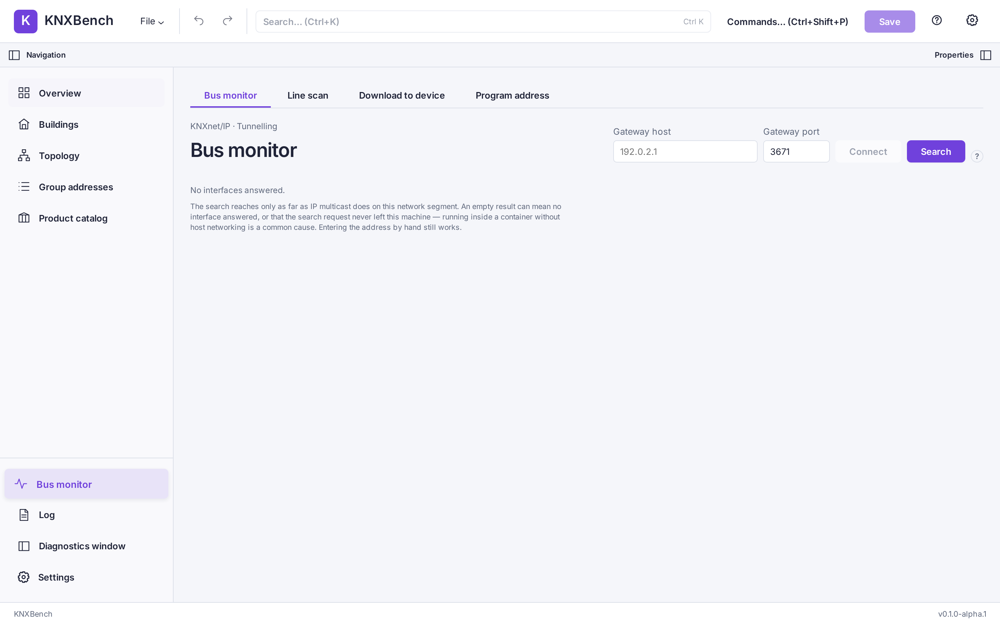
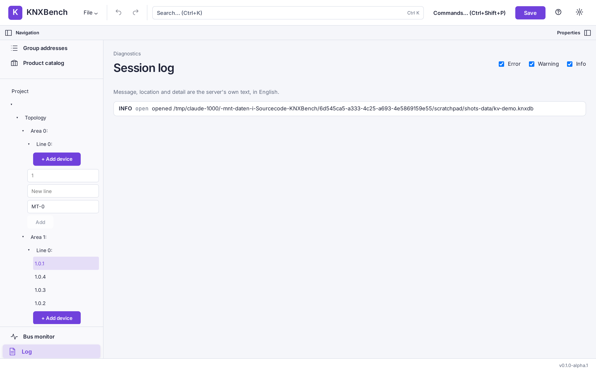

← Previous: [A complete configuration workflow](06-configuration-workflow.md) · [Manual index](../README.md)

# Bus monitor and KNXnet/IP

Everything so far happened inside a file. This chapter is the one where KNXBench
talks to an actual installation — and, just as importantly, the chapter that says
plainly what it will not do there.

## What KNXnet/IP is

A KNX installation is a twisted-pair bus that no computer can plug into directly.
KNXnet/IP is the standard that puts KNX telegrams inside IP packets, so a KNX IP
interface or router on your network can act as the door between the two.

KNXBench never speaks to the bus itself. It speaks to that interface over IP, and
the interface does the electrical part.

## Discovery: finding an interface

A KNXnet/IP interface announces itself when asked. KNXBench sends a multicast
`SEARCH_REQUEST` to the standard group `224.0.23.12` on port `3671`, and every
interface that hears it answers with its name and address.

Discovery is available in the UI and on the command line:

```bash
knx bus discover
```

The graphical bus monitor offers **Discover gateways** through the same
server-side discovery call. The CLI remains useful for terminal diagnostics.
Line scan still requires a known control endpoint to be entered manually.

> **Note**
>
> An empty discovery result usually means the request never left your machine rather
> than that you own no interfaces. Multicast and Docker's default bridge network get
> along about as well as two cats in one carrier — see
> [Web and Docker deployment](11-web-and-docker.md).

## Tunneling and routing

There are two ways to carry KNX over IP, and KNXBench treats them as two different
things because they are.

**Tunneling** is a point-to-point conversation with one interface. You connect to a
host and port, the interface hands your session its own individual address, and it
forwards telegrams in both directions. It works across normal switched networks, and
it is confirmed: the interface tells you whether your frame made it.

**Routing** is multicast. Frames go to a group address on the network and every KNX
IP router listening there picks them up. Nothing confirms anything. It needs a network
that actually carries multicast between the machines involved.

The graphical bus monitor supports **tunneling only**. Routing is command line only,
through `knx bus route-monitor` and `knx bus route-send`, both described in
[The command line](10-command-line.md).

## Connecting the bus monitor

Open **Bus monitor** from the navigation sidebar. Enter the interface's numeric
IPv4 address in **Gateway host** and its UDP port in **Gateway port** (3671 by
default), then press **Connect**. A blank port uses 3671; a port outside 1–65535
is rejected before any connection. This tunnel currently accepts IPv4 only:
hostnames and IPv6 addresses remain visible if they were saved previously, but
the form explains why it cannot connect to them.

If you saved a preferred gateway in Settings, a newly opened monitor starts with
that address. You can replace it without changing the saved preference. **Discover
gateways** lets you select a discovered endpoint; the selection does not connect
until you press Connect.



The pictured empty discovery result uses a local UI test fixture, not a live
measurement of a KNX network.

Notice the eyebrow above the title: *KNXnet/IP · Tunnelling*. That is the panel
telling you which transport it uses, and it is the only one it offers. The telegram
table below is empty because no session is running yet.

While a session runs, both gateway fields are locked — KNXBench tells you to
*"Disconnect the running session before changing the gateway address."* Once connected, the panel
shows `Session <id>`, followed by the individual address the interface assigned to
your session.

## What the monitor shows

Every telegram the interface forwards becomes one row, with these columns:

| Column | What it holds |
| --- | --- |
| Seq | A running number, so gaps are visible |
| Time | When KNXBench received the telegram |
| Source | The individual address that sent it |
| Destination | The group address (or individual address) it went to |
| Service | The KNX service, for example a group-value write |
| Control | Received priority, hop count, and whether an `L_Data.ind` was repeated |
| Payload | The raw bytes |
| Decoded | The value, interpreted as a datapoint type |

**Control** shows priority and hop count as received. A repeat state is
shown only for an indication: **Repeated** and **Not repeated** mean different
values; requests and confirmations do not carry that same assertion. A
session-closed notice is not a frame, so it has no control fields. An older
server that does not send them is shown without invented defaults. The same
facts appear in the selected row's details. This is display-only; inspecting
a row does not send a telegram.

The **Decoded** column is the interesting one. If a project is open when you connect,
KNXBench takes a snapshot of that project's group addresses and their datapoint types
and decodes each telegram against it. A raw `0x01` becomes something you can read. See
[Datapoint types](../knx-basics/04-datapoint-types.md) for what those types are.
The row and its details distinguish **No DPT assigned** (including no project),
**Conflicting DPTs**, **Unsupported DPT** (the codec does not implement the resolved
type) and **Decode failed** (the resolved type could not decode this payload). An
older server that supplies an error without a structured reason is labelled
**Decode error (reason unknown)** instead of guessing from its prose. The raw
payload, resolved DPT where known and original error text remain available.

Changing the group-address style refreshes the running session's complete address
and decoding context, including a style change made through Undo or Redo. It does
not rewrite telegram rows already collected. Other group-address name or datapoint
type edits do not independently refresh that context. When the editing window
or the server's periodic comparison detects such a mismatch, sending is locked
and a notice asks you to reconnect against the current project. The server
compares its actual session context with the current project's names, resolved
datapoint types and address style, including edits from another client. Local
browser records cannot prove freshness. Missing, unavailable or malformed
evidence (including an older server) and failed polls leave sending disabled,
even with an explicitly entered DPT. This is a point-in-time check, not project
collaboration or a transaction-bound guarantee for a later write; see the
[known limitations](../known-issues.md). Already captured rows keep the values
they were decoded with.

**Pause** stops telegram collection without ending the gateway session or moving
its cursor. Context/status-only polls continue, so Pause cannot conceal a stale
or unavailable project context. **Resume** asks for telegrams buffered in the meantime. If either
the server or the panel has discarded older rows, it reports the losses separately;
Pause cannot guarantee an unlimited backlog. **Disconnect** ends the session but
leaves its captured rows available to inspect and export until another session
starts or the panel is closed. Neither Pause nor filtering blocks a deliberate
**Send a value** operation; that separate action still writes to the live bus.

The labelled filter box narrows rows by destination or name; service checkboxes
limit the visible table further. These controls filter already captured rows in
the browser, without changing the capture, statistics or server cursor. On a
narrow window, focus the labelled telegram-table region and use Left/Right to
scroll the columns horizontally rather than squashing the decoded labels.
The expandable **Statistics** section counts services, busiest destinations and
most frequent sources from the *currently retained* telegrams only. It excludes
the synthetic gateway-close marker and shows at most ten entries per category.
The panel keeps at most 1000 captured rows; older client rows are removed and
counted separately from the server's dropped-row indicator.

**Export capture** downloads a UTF-8 JSON v1 snapshot, not CSV or an ETS file.
It includes retained rows (`seq`, `timestamp`, `source`, `destination`, optional
`destinationName` and `rawPayload`, `service`, `decoded` with DPT/value or
error where available, and `control` when supplied by the server) and metadata:
`format: "knxbench-bus-monitor"`, `version: 1`,
`capacity: 1000`, session/process identity, status, export time,
`serverDroppedBefore`, `clientPrunedCount` and a loss notice. JSON quotes
formula-looking names as data, rather than creating spreadsheet cells. In a
browser the file is downloaded locally; in the desktop app the native save
dialog selects the destination and a validated, atomic write preserves an old
file if validation fails. Both paths refuse files over 16 MiB. **This is only
a bounded session snapshot, not a complete bus history.** It contains addresses
and payloads; treat the exported file as private.

## The flow view

Above the telegram table, **Telegrams** and **Flow** switch between two views
of the same session (arrow keys move between them). The flow view reads the
telegrams the monitor already receives. Opening it does not connect, start or
send anything.

- **Circles** are senders and the devices configured in the project as
  members of the group address. A **solid line** to a device means *configured
  in the project*. It does not mean the device received or processed the
  telegram. A **box** is a group address without a resolved member, reached by
  a **dashed line**.
- A sender whose address belongs to several project devices is drawn once,
  marked ambiguous, and names its candidates; KNXBench does not pick one. A
  sender with no project device, and every sender the project could not
  interpret (no project open, an older project state), is drawn by its
  address only, and the Inspector says why.
- Under each node, up to three **current values** appear with their group
  addresses, newest first. A value at a configured member is marked **◇**: it
  was seen on the group address, not read back from that device. A value stays
  for 7 seconds after it was observed. A read request shows no value and does
  not extend one.
- Select a node with the arrow keys and **Enter**, or by clicking it. The
  **Inspector** lists all current values with their sender, every connection
  with its group addresses, and the linked objects of both ends with
  direction, activation and the six flags (*unknown* where the project does
  not state one). **Shift**+arrows pans, **+**/**−** zoom, **0** resets the
  view.
- Telegrams are always matched against the project state the server used when
  it received them, never against a later edit. A new session starts a new
  map; nothing is stored.

- **Motion.** Each telegram sends a short pulse along its lines; the sender's
  ring lights up as it leaves. Pairs that talk often move closer, quiet ones
  drift apart, and the most active sender of the last 60 seconds moves
  towards the centre and is named above the map. Lines that stay quiet fade
  after ten seconds to a faint resting line; they never disappear while the
  session lasts. A pulse is an illustration: the value is already shown when
  the telegram arrives, not when the pulse does.
- Only what changed moves: a new device or connection shifts its own
  neighbourhood, and the rest of the map stays where it is. Neighbours keep
  clear of a node's name and of its values, also around a busy sender.
- **Freeze layout** stops the movement of the nodes. Pulses, values and the
  sender ranking keep running.
- **Motion Off** (in the settings) or the system's *reduce motion* stops all
  movement and pulses at once; values, arrows and the Inspector stay. Freeze
  is then not needed and is greyed out.
- On a very busy bus, many telegrams on the same path are drawn as one pulse
  marked ×*n*, and more than 160 at once are counted rather than drawn. A
  note above the map says so. Values and counts are always complete.

Movement costs processor time: on a busy bus, or on a slower computer, *Motion
Off* keeps the view light and loses no information. With several hundred
devices and around a thousand telegrams a second, movement keeps the
processor fully busy and the window can react with a delay of a few tenths of
a second; switch Motion Off for such a bus. See [known limitations
§154](../../KNOWN_LIMITATIONS.md#154-the-telegram-flow-view-is-checked-and-measured-in-chromium-only).

## Sending a value

The bus monitor includes a **Send a value** form, with three fields — Destination,
DPT, Value — and a **Send** button.

This form transmits a group-value write to the connected installation. Lights change,
blinds move, heating setpoints shift. The application says it in the form itself:
*"Sends to the connected bus. Project Undo cannot reverse this action."* KNXBench's
undo history covers the project file, not the physical world.

Before you use it, be certain that the group address you typed is the one you mean, and
that operating it now is safe for whoever is in the building. Sending is disabled when
the session is closed, and also when the project snapshot has gone stale, because a
value encoded against an out-of-date datapoint type is a value you did not intend to
send.

Clicking a row in the telegram table prefills the form's destination with that row's
address. It does not send anything.

## The session log and the diagnostics window

The **Log** entry in the sidebar opens the session log: everything KNXBench did this
session, filtered by Error, Warning and Info.



Log entries are the server's own text and stay in English even when the interface is
translated — a deliberate choice, so an error message you paste into a bug report
still means the same thing to whoever reads it.

The **Diagnostics window** button opens the bus monitor and the log in a second window,
which is useful on two screens: watch the bus on one, edit the project on the other.
That window is read-only with respect to the project. It has no undo, it shares the
main window's bus session rather than opening a second one, and it cannot edit
anything. It can still connect and still send a value — the restriction is about the
project, not about the bus.

## Ending a session

Press **Disconnect**. KNXBench prints a summary of what the session saw, in the form
*"Stopped session 3: 412 telegrams seen, 0 dropped."*

A session can also end without you: the interface can close it — the panel adds
*"— closed by gateway"* — or the other window can end it, in which case you see *"The
bus session was ended elsewhere."* There is one session at a time; starting a new one
replaces the old one and clears its rows.

## Device checks: offline readiness, then an optional read-only comparison

Open a project, choose **Bus monitor** in the navigation sidebar, then **Device
checks** (German: **Geräteprüfung**). The readiness table checks every project
device **offline** against the installed product database. It includes devices
without an individual address and excluded devices, with their original
readiness code, refusal category/detail or evidence, step/octets counts where
available, and the server's counts by grade. **Verified on one device** is
scoped to a documented application and download operation; it is not a
promise for every device or configuration. **Plannable, not live-verified**
means the plan built but has no matching hardware evidence. If the project or
product database is missing, the panel reports the server's refusal instead
of inventing grades. **Refresh readiness** recomputes the current project.

**Compare with a device** is a separate operation. Only plannable devices
with a unique individual address can be selected; a duplicate address is
shown in the table but never guessed as a target. Choose a gateway and click
**Review read-only comparison**. This does not connect. Read the target and
gateway shown in the second step, then click **Read device now** if you intend
to open a KNXnet/IP management tunnel. The operation reads the actual device's
memory regions and load states for the *complete* download plan, and shows
every differing byte range as current device bytes versus planned project
bytes. It sends no device write and has no access-key field. A device that
requires protected reads may refuse it. The gateway's one tunnel must be
free; stop the monitor, scan or download first. Leaving this view does not
cancel a read already in progress. The memory bytes can be private
configuration data: do not share screenshots or logs of them casually.

The comparison view does not offer the API's optional partial selection; it
always compares the complete plan. The comparison is not a backup and does not prove that a later download will
succeed. The UI tests use only a mocked local server, never a live device.

## Downloading to a device

*Download* here means KNXBench → device over the bus: the device's configuration
changes, the project does not. Saving or exporting a project file is something else
(see the [glossary](../../GLOSSARY.md)).

1. Open the project that contains the device, then **Bus monitor** in the navigation
   sidebar and its **Download to device** tab (German: **In Gerät laden**), beside the
   monitor and the line scan. Only devices that have an individual address are offered.
2. Choose the device, **What to write** and the gateway, then **Show what would be
   written**. *What to write* is **Complete download** (the default), or a partial
   download (KNX Configuration Procedures §3.9.2.4) of **Parameters only**, **Group
   addresses only** or **Parameters and group addresses**. A partial plan says which
   parts it does not write and lists every application write it skips (only absolute
   data or stack segments in EEPROM are written); before writing it checks that the
   device already carries this application with every part loaded, and otherwise stops
   without writing. If the server cannot derive the chosen partial download, it says why
   and shows no plan; run the complete download instead. Changing the choice discards a
   shown plan. The plan
   names the application program, the mask and manufacturer the device must report
   before the first write, the parameter values and group links taken from the project,
   every memory segment with the octets written, and every step. Nothing has been sent.
   Any edit to the project discards the plan; ask for it again.
3. **Download to 1.1.67** (with your device's address) asks for confirmation in the
   programming dialog. Only after you confirm does the server open a tunnel. It refuses
   if the bus monitor or a line scan holds the gateway's tunnel, and it refuses a plan the
   project no longer yields.
4. While it runs the tab shows step *n* of *m*, the octets written and read back against
   the total, and every data block with its address and octets, each one only after the
   device read it back unchanged.
5. It ends with one of three lines. **Written to the device: yes** means every block was
   read back unchanged. **No** means the device was not changed. **Partially** means the
   device may be partly loaded; download again. If the device did not acknowledge the
   closing restart, the tab says **Restart: NOT confirmed** next to "yes": the data is in
   the device, and some devices restart without answering, so check that it works.

There is no stop button: stopping between steps would leave the device in an undefined
state. The server cannot tell a person from a script; like the command, it only checks
that the request names the device it was shown.

## Programming an individual address

This gives *one* device its individual address: whichever device has its programming
button pressed. Only the address is written; this is not a download of parameters.

**Current safety gate (2026-10-01): programming cannot be started.** The
server has no verified durable pre-write recovery for the button-selected
device. The tab reads that recovery precondition and displays its refusal
before asking for consent; its Program button remains disabled. If the
status cannot be read, it remains disabled and offers a retry. Even if the
status later changes, the server checks again on every start. A confirmed
start currently returns HTTP 412 before a tunnel opens. Read-only status
and stopping an already-held session remain available. Do not press a
device's programming button expecting this build to program it.

The steps below describe the retained procedure for a future recovery-ready
server and simulator tests, **not an available write path today**:

1. **Bus monitor** → **Program address** tab (German: **Adresse programmieren**). Type
   the new address (the project's device addresses are offered as suggestions), the
   gateway, and how long to wait for the button (1–600 s, default 120).
2. The tab lists what happens: wait for exactly one device in programming mode, then
   the four steps of the standard procedure (check the address is free, count again,
   write, connect to the new address, read back and restart, which ends programming
   mode). Once the safety gate is lifted, **Program 1.1.30** would ask for
   confirmation; a valid phrase alone never authorizes a tunnel.
3. While waiting, the tab says what the person at the device must do: **press the
   programming button**, or, if several devices are in programming mode, **release all
   but one**. **Stop waiting** ends the wait; nothing has been written at that point.
4. Once exactly one device answers, the procedure runs to its end and cannot be stopped.
5. It ends with **Address written: yes** (old → new address), **no need** (the device
   already had it), **no**, or **yes, but NOT confirmed**: the address went out, but the
   device did not answer at it afterwards. Check that device with a read before anything
   else. A device that answered at its new address but did not acknowledge the closing
   restart still counts as **yes**; some devices never acknowledge a restart.

The CLI retains read-only planning for the same procedure as
[`knx device program-address`](10-command-line.md#knx-device-program-address--give-a-device-its-individual-address).
Confirmed CLI starts are also blocked before a tunnel. Once recovery is
implemented, the tab would also refuse while the monitor, a line scan or a
download holds the gateway's tunnel.

## Debug: Individual Address Write Enable

**Settings → Debug · device control** must first show the server-confirmed
manual opt-in as enabled. With a project open, choose **Bus monitor → Debug ·
service control**, type the *existing* address of the intended device and the
gateway, and click **Read device control now**. Merely opening the tab or
typing an address does not connect. The read shows Device Object
`PID_SERVICE_CONTROL` bit 2, the complete two-byte value and the mask. A
`403` means the server setting is off; this happens before a tunnel opens.
The gateway serves one tunnel; stop any monitor, scan or download first.
Leaving this view does not cancel a read or write already started.

Only after checking the returned address, value and mask should you choose
**Review change**. The next step displays the exact device-specific phrase
`I confirm individual-address write enable to <address>`. **Type it yourself**;
the UI does not fill it in. **Write bit after backup** then requests exactly
that bit be enabled or disabled (the opposite of the state you just read).
The server checks the setting and phrase again, reads the property in the
same session, saves its original two octets, mask and target durably before
the write, changes only bit 2 and reads back the exact value. A failed backup
refuses before the write. On a write, the UI displays the server-reported
recovery file path; keep it for **manual** diagnosis. A failed readback or an
unconfirmed result leaves the device state uncertain: re-read it before
anything else. A property record is **not** a full device image and cannot
restore other possible manufacturer side effects. Switching this option on
never automatically enables it for a download or serial-address write. No
live bus was contacted to validate this UI.

## What KNXBench does and does not do on a bus

This section is deliberately plain.

**What KNXBench reads from a bus.** Telegrams that the interface forwards to it. The
individual address an interface assigns to a tunneling session. During a line scan, the
device descriptor that a device returns when asked. During a deliberately confirmed
**Device checks** comparison, the memory regions a complete plan would overwrite,
plus affected load states and device identity. This is read-only management traffic,
but it still occupies the gateway's tunnel; offline readiness contacts no device.

**Group-value writes to a bus.** These come from exactly three places:
the `Send a value` form in the bus monitor, the `knx bus write` command over
tunneling, and the `knx bus route-send` command over routing. A line scan additionally sends connection-oriented management frames — a connect, a
device-descriptor read, a disconnect — to each candidate address. Those are traffic on
the bus, and they occupy the addressed device briefly, but they do not change anything
in it.

**What KNXBench writes to a device.** A download of a project device's configuration
*to the device* (application tables and parameters), from two places: the
`knx device download` command and the **Download to device** tab described
[below](#downloading-to-a-device). Both show the plan first and write only with the
confirmation for that one device. It has been verified on one product family on one
device so far. See
[`knx device download`](10-command-line.md#knx-device-download--download-a-project-devices-configuration-to-the-device).

**Individual-address programming is currently blocked.** The retained CLI and
**Program address** tab ([above](#programming-an-individual-address)) can
describe the procedure, but confirmed starts fail before opening a tunnel
until durable device-specific recovery exists. A prior live round trip on one
device is historical evidence, not current write permission.

**What KNXBench writes to a device, continued.** A manual Debug action can
change only the Individual Address Write Enable bit of Device Object
`PID_SERVICE_CONTROL`, after server-side opt-in, a device-specific phrase and
a durable property-level backup. This is independent of both download and
address programming; see [the Debug procedure](#debug-individual-address-write-enable).

**What KNXBench does not do.** Unloading a device, and secure devices. If you need to commission an installation today, you need a tool
that does commissioning; KNXBench is not yet one.

**The guard rails that actually exist in the code.**

- Writes to a device go through a management-session layer in the networking crate. A
  session that was not handed a write authorisation returns an error before touching the
  transport. An authorisation for real hardware exists only with the operator's phrase
  naming that device, and only for the kinds of write that have been verified. Two
  entry points for the supported scopes include `knx device download` and
  the Download to device tab, `knx device program-address` and the Program
  address tab, plus the explicitly enabled service-control CLI and Debug tab.
  The server routes demand their separate, device-specific phrases; the
  service-control route additionally refuses unless its persisted Debug
  setting is exactly `true` and saves the original property before writing.
  The download route refuses a plan the project no longer gives
  (ADR-0045), and the address route's one phrase covers the closing restart
  (ADR-0046).
- KNXBench compiles in a list of individual addresses that must never be contacted. The
  scan planner never generates them into a candidate list in the first place, and the
  address type used for probing cannot be constructed without passing that check — so
  "we forgot to check" is not a reachable state rather than a discipline.
- The line scan's `--exclude` flag accumulates across every occurrence, and a malformed
  address aborts the command before a single frame is sent.
- Both `knx bus write` and `knx bus scan` accept `--dry-run`, which encodes and prints
  exactly what would go out without opening a connection.
- The HTTP API also exposes explicit gateway discovery and line-scan operations,
  including estimate, start, results, cancel, comparison and reconciliation.
  These are separate from commissioning and do not program devices. Scanning
  sends management traffic; reconciling changes the *project* through the
  normal undoable edit path, not the physical devices.

For the longer catalogue of what is missing and why, see
[Supported and unsupported KNX/ETS functionality](../reference/02-supported-and-unsupported.md)
and the project's own [known limitations](../../KNOWN_LIMITATIONS.md).

[Manual index](../README.md) · Next: [Documentation export and project comparison](08-reports-and-diff.md) →
