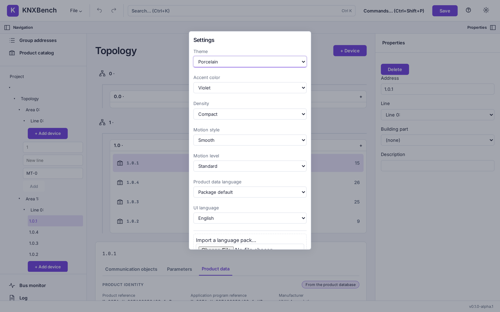

← Previous: [Documentation export and project comparison](08-reports-and-diff.md) · [Manual index](../README.md)

# Settings, themes and languages

KNXBench's settings are short on purpose. There is no preferences tree with forty
pages of checkboxes — there are seven controls and a language-pack manager, and every
one of them applies the moment you change it. No Save button, no restart.

## Opening Settings

Click the gear button at the right end of the toolbar, or open the command palette with
`Ctrl+Shift+P` and run **Settings**. The panel opens over the workspace; Escape closes
it.

The fields appear in the order used below. The panel in the screenshot is scrolled to
the top; the language-pack manager sits just under the last field.

## Theme

Six entries, five of them real palettes:

| Entry | What it is |
| --- | --- |
| System | Follows your operating system's light/dark preference |
| Porcelain | Light. The theme every screenshot in this manual uses |
| Graphite | Dark |
| Cupertino | A light theme with its own fixed accent |
| Neon Grid | A dark theme with its own fixed accent |
| Bitcoin DeFi | A dark theme with its own fixed accent |

**System** is not a palette of its own. It resolves to Porcelain when your desktop asks
for a light appearance and Graphite when it asks for a dark one, and it re-resolves
live — change your desktop's setting while KNXBench is open and the window follows.

## Accent color

Five accents: Violet, Mint, Blue, Amber and Rose. Violet is the default, and the one
in the screenshots.

The accent tints interactive elements only. Status colors — the red of an error, the
amber of a warning — never depend on it, because a color that means something must not
change meaning when you pick a nicer purple.

Three themes carry their own accent as part of their identity, and under those the
control is disabled with the reason spelled out on screen: *"This theme keeps its own
accent; the accent setting has no effect here."*

## Density

**Compact** or **Comfortable**. Compact is the default: more rows on screen, less
padding around them. Comfortable does the opposite. Nothing is hidden in either mode;
it is only spacing.

## Motion style and motion level

Two separate controls, because "how much movement" and "what kind of movement" are
different questions.

**Motion style** picks the character of the animation:

- **Smooth** — restrained, Apple-ish easing. The default.
- **Glitch** — sharper, cyberpunk-flavored transitions.

**Motion level** picks how much of it you get:

- **Off** — no animation.
- **Subtle** — reduced.
- **Standard** — the full set. The default.

> **Tip**
>
> If your desktop is set to reduce motion, KNXBench obeys it regardless of what these
> two controls say. That rule is enforced in the stylesheet rather than in application
> logic, which is a polite way of saying no future setting can accidentally override
> your accessibility preference.

## Product data language

Which language KNXBench reads product texts in — device names, parameter labels,
communication object names — when the installed product database ships more than one.
See [Products and product databases](../knx-basics/05-products-and-product-databases.md)
for what a product database is.

The list is built from the database that is actually installed. Each entry names the
language and how many strings it has, so a language with twelve translated strings
does not look like a complete one. **Package default** means "whatever the package
itself declares", and is the default choice.

With no product database installed, the control is disabled and reads *"No product
database installed"*.

## UI language

KNXBench ships two interface languages: **English** and **Deutsch**. On first start it
picks one from your browser's or system's language — anything whose primary language
tag is `de` gets German, everything else gets English — and after that it uses whatever
you chose here.

Two things stay English regardless of this setting:

- Session log entries. Message, location and detail are the server's own text, and the
  log panel says so above the list. An error you paste into a bug report should read the
  same to everyone.
- Your project's own content. Device names, group address names and descriptions are
  data, not interface.

The project's own text language is a separate, per-project thing, chosen when you create
the project — see [Projects: create, open, import, save, export](02-projects.md).

### Language packs

Below the UI language selector is a small pack manager. KNXBench can load an additional
interface language from a JSON file at runtime, without a rebuild:

- **Import a language pack…** — pick a `.json` pack. KNXBench validates it and reports
  what happened: how many strings were translated, how many fall back to English (with
  examples), any keys it did not recognize, and whether plural forms are supported for
  that language.
- **Export English template…** — writes out the full set of English strings as a
  starting point for a translation.
- **Installed language packs** — each installed pack with an **Export…** and a
  **Remove** button.

An installed pack appears in the UI language selector under its own name. A pack whose
language tag collides with a built-in language is not offered for selection — the
built-in wins — and the import report tells you so rather than leaving you wondering
why nothing changed. Rejected packs get a specific reason, not a generic failure.

For the pack format itself, see [Language packs](../../LANGUAGE_PACKS.md).

## What is not in Settings

**The group address style.** Whether addresses read as `1/2/3`, `1/3` or a single
number is a property of the project, not of the application, so it is not here. You
choose it in the **New project** dialog, and the Project node in the Inspector shows
the current project's style as a read-only fact. There is no control anywhere in the
interface that changes the style of an existing project.

> **Note**
>
> The New project dialog's hint text says the project properties can restyle it later.
> The server can indeed do that, but no button in the interface calls it today. Treat
> the choice you make in that dialog as the one you will live with for now, and see
> [Group addresses](../knx-basics/03-group-addresses.md) for what the three styles mean.

**Anything about the bus.** Gateway addresses are typed into the bus monitor itself and
are not remembered between sessions. See
[Bus monitor and KNXnet/IP](07-bus-and-interfaces.md).

**Anything about the server.** Ports, data directories and static file locations are
environment variables, not settings — see
[Web and Docker deployment](11-web-and-docker.md).

## Where settings are stored

Every setting on this panel is stored locally by the web frontend, under keys beginning
`knx-desktop:` — `theme`, `accent`, `density`, `motion-level`, `motion-style`,
`product-language`, `ui-language`, and `ui-language-packs` for imported packs.

Consequences worth knowing:

- **They survive a restart.** Close KNXBench, open it again, and your theme, density,
  motion and languages are as you left them.
- **They are per browser and per origin.** In the web build, opening the same KNXBench
  server from a different browser, a different machine, or a private window gives you
  the defaults again. The desktop shell runs the same frontend inside its own embedded
  web view, so its settings are stored separately from any browser's.
- **They are not part of your project.** Sending someone a `.knxdb` file does not send
  them your theme, and deleting a project does not reset your preferences.
- **They are not on the server.** The server stores projects; it does not store who
  likes Graphite.
- **An unreadable or unknown value falls back to the default** rather than failing.
  If storage is unavailable entirely — some private browsing modes — the settings still
  work for the current session and simply do not persist.

[Manual index](../README.md) · Next: [The command line](10-command-line.md) →
